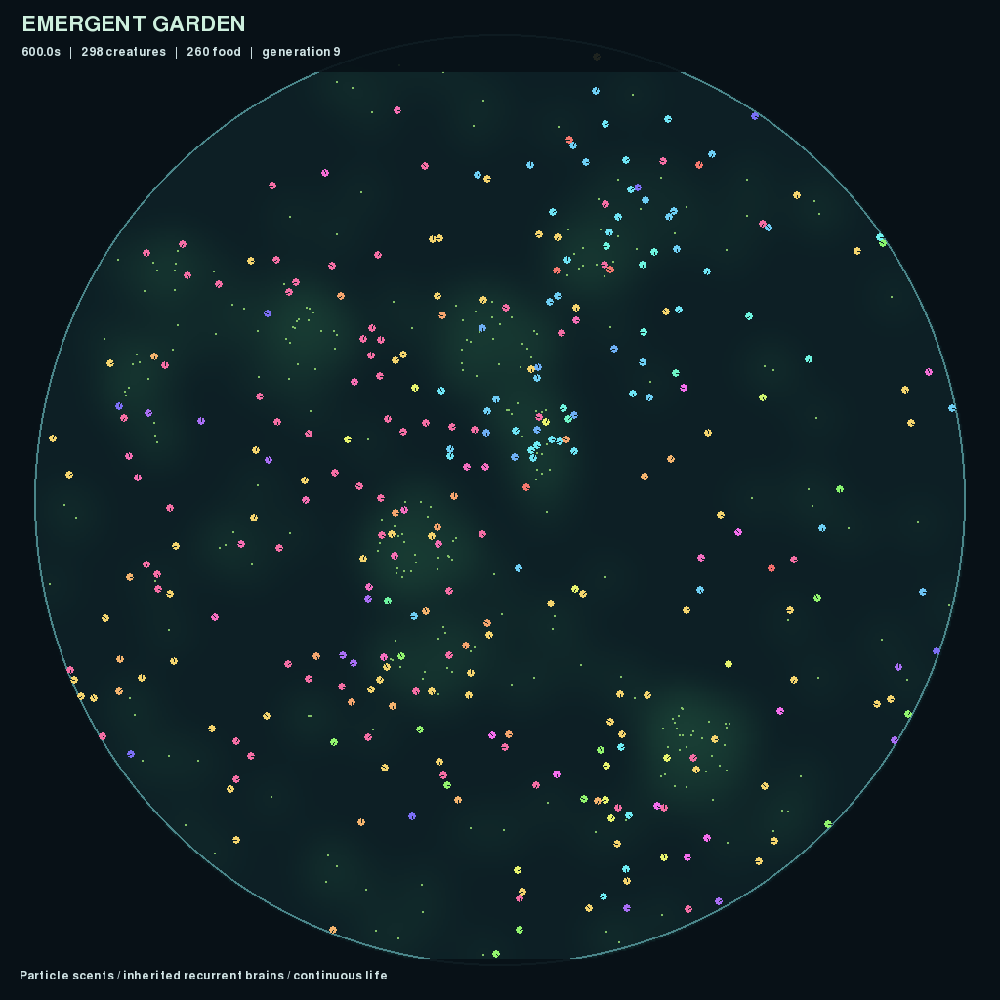

# Emergent Garden

A continuous 2D artificial-life dish. Creatures have four local smell sensors,
energy and contact inputs, 16 recurrent neural units, and two propulsion actuators.
They consume food particles, spend energy, and produce offspring with mutated
brains. There is no behavioral reward or global parent ranking.



## Start watching

Python 3.13 and all Python packages are managed with **uv**:

```bash
uv sync --locked
uv run garden run --view --device cpu --seconds 0
```

`--seconds 0` runs until you close the window, press Ctrl+C, or the population
becomes extinct. A checkpoint and preview are saved on exit. Every run gets its
own directory under `runs/`; a supplied `--output` directory must not already exist.

The default preset starts 256 creatures in a 1,024-unit dish, with continuous
reproduction and a capacity of 2,048. At full view creatures are about eight pixels
across; zoom in to inspect their sensors and actuator activity.

| Control | Action |
| --- | --- |
| Space | Pause/resume |
| `+` / `-` | Increase/decrease simulation speed |
| Mouse wheel | Zoom, up to 8x |
| Right-drag | Pan |
| Left-click | Select a creature and inspect energy, lineage, and neural activity |
| `F` | Toggle the smell overlay |
| `R` | Reset the camera |
| Escape / close window | Save and exit |

## Headless runs and recordings

```bash
# Run an experiment without a window; record a 100x timelapse.
uv run garden run --device cpu --seconds 3600 --record --output runs/experiment-1

# Run overnight until stopped; sample video at a higher timelapse speed.
uv run garden run --device cpu --seconds 0 --record --video-speed 1000 --output runs/overnight-1

# Resume for 600 additional simulated seconds, optionally with a window.
uv run garden run --resume runs/experiment-1/latest.pt --device cpu --seconds 600 --view
```

All durations describe simulated time. Rendering, video sampling, and wall-clock
throughput do not change the physics timestep. Video streams to MP4 rather than
accumulating frames in RAM. Recording slows execution if the encoder cannot keep
up; frames are not silently skipped. Use a larger `--video-speed` for compact
overnight recordings, or omit `--record`.

Ctrl+C and termination requests finish the current simulation tick before saving.
Checkpoints are also written every five wall-clock minutes. Resume uses the
checkpoint's configuration, seed, controller, fields, population, and random
streams. Resume on the same CPU/CUDA device type; different hardware or dependency
versions may produce numerical differences. Forced process kills cannot save.

Run outputs include:

- `config.toml` and `metadata.json`: resolved settings and runtime details.
- `metrics.jsonl` and `events.jsonl`: population, resources, costs, births, deaths,
  genetic diversity, lineages, and throughput.
- `latest.pt`: an atomic full-world checkpoint.
- `founders.pt` and `population.pt`: initial and current genomes for evaluation.
- `preview.png`, `summary.json`, and optional `timelapse.mp4`.

`latest.pt` and `population.pt` retain the latest saved state, not every historical
population. Copy checkpoints you want to archive before continuing a long run.
Independent resumed runs write to new directories, preserving the source run.

## CPU and GPU

The locked Linux/Windows PyTorch build uses CUDA 12.8 and was tested on an RTX 5080.
CUDA is optional at execution time; the same implementation also runs on CPU.

```bash
uv run garden doctor --device cuda
uv run garden run --device cuda --seconds 600
```

`--device auto` selects CUDA when available. **CPU is currently faster for the V0
population size**, so the examples explicitly use CPU. Initial full-size checks
measured roughly 5–6x simulated speed on CPU and about 0.9x on the 5080. The current
CUDA path is functional but has significant overhead from small, dynamic tensor
operations. Throughput depends on population, contacts, field resolution, and
recording; measure a representative run before allocating an overnight experiment.

CPU execution defaults to one PyTorch thread because these operations are small.
To experiment with another setting, use `uv run garden --threads 2 run ...`.
A live window needs a working desktop/display; headless simulation and recording
do not. `doctor` reports the selected backend and package/runtime versions.

## Configure an experiment

The agreed starting values are in [configs/v0.toml](configs/v0.toml).

```bash
uv run garden config configs/my-experiment.toml
# Edit the new file, then run it:
uv run garden run --config configs/my-experiment.toml --device cpu --view
```

Partial TOML files inherit unspecified defaults. Unknown keys and invalid values
are rejected. Keep physics/controller/field rates at integer ratios. Tune food
supply, metabolism, and food spacing first, and change one group of parameters at
a time. The saved configuration makes each experiment reviewable.

## Calibration and behavioral evaluation

```bash
# Five independent 600-second ecological runs with the default parameters.
uv run garden calibrate --device cpu --output runs/calibration-1

# Diagnostic controllers; these do not seed the evolving population.
uv run garden calibrate --device cpu --controller forager --seeds 1 --seconds 120 --output runs/forager-1
uv run garden calibrate --device cpu --controller rest --seeds 1 --seconds 120 --output runs/rest-1

# Compare saved founders and living descendants on fresh environments.
uv run garden evaluate runs/calibration-1/seed-1 --device cpu --output runs/evaluation-1

# A smaller exploratory evaluation before committing to the full batch.
uv run garden evaluate runs/calibration-1/seed-1 --device cpu --genomes 4 --seeds 10001 10002 10003 10004 --output runs/evaluation-small
```

The full evaluation samples up to 32 founder and 32 descendant genomes, tests each
on eight fresh seeds for 120 simulated seconds, and repeats descendant trials with
smell disabled or sampled at shuffled spatial locations. Each trial has its own
dish and fresh neural state. Mutation is disabled during evaluation; ordinary
feeding, energy costs, and reproduction remain active. Reports distinguish the
tested founding creature from its offspring.

Results include individual trials, sampled genomes, summary statistics, and
paired sensory effects. Repeat evaluations across independent evolutionary runs.
The small exploratory batch is a workflow check, not sufficient evidence of
evolved sensing or learning. Population survival and reproduction are implemented;
reliable improvement over founders and a sensory advantage must be established
through these experiments.

## Development

```bash
uv add PACKAGE
uv add --dev PACKAGE
uv run pytest -q
uv run ruff check .
uv run ruff format --check .
```

Commit changes to both `pyproject.toml` and `uv.lock`. The CUDA package index is
configured in the project; additional GPU libraries are not needed for CPU use.
Video encoding uses the FFmpeg executable bundled by `imageio-ffmpeg`.

The tests cover conservative food allocation, energy costs, starvation, collision
handling, mutation, birth failures, recurrent state, field sampling, exact CPU
checkpoint continuation, and independence from rendering/recording.

- [V0 specification and implementation milestones](PLAN.md)
- [Initial validation results and current limitations](VALIDATION.md)
- [Original long-term research specification](spec.md)
