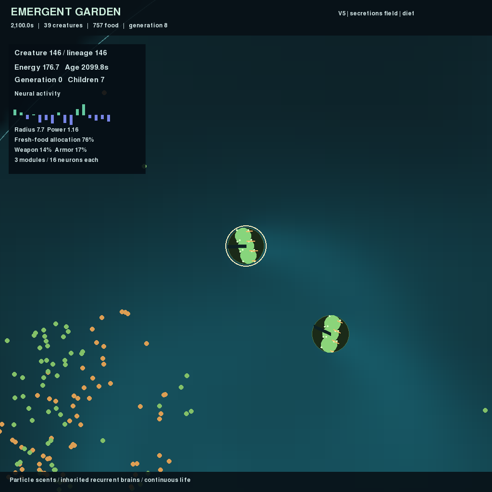

# Emergent Garden

A continuous 2D artificial-life world with evolving neural controllers, resource
cycling, predation, inherited bodies, and persistent chemical trails. Creatures
spend energy, reproduce, and mutate. There is no behavioral reward or global
parent ranking. V0 and every subsequent experimental preset remain available.



The five-version development record, including failed hypotheses and controlled
comparisons, is in [EVOLUTION.md](EVOLUTION.md). Persistence and sensory effects
have been observed; useful forecast memory, communication, and open-ended
intelligence have not been established.

Continuing experiments on learning and evolving neural architecture are recorded
in [CONTINUATION.md](CONTINUATION.md). The experimental [V6 preset](configs/v6.toml)
adds patch identities with changing nutritional value and food/damage feedback.
The [V7 preset](configs/v7.toml) adds heritable plasticity rules: each body module
can alter its recurrent connections during life, and offspring inherit the rule
with fresh synaptic state. These mechanisms are implemented; useful association
learning has not yet emerged in the measured populations.

To inspect V7 locally, resume `runs/v7-inherited-plastic/seed-81/latest.pt` with
`--view`, or start `uv run garden run --config configs/v7.toml --seed 71 --view
--device cpu --seconds 0`. [The inspector](docs/v7-preview.png) shows synaptic
change and the modulation gate. A verified 30-second recording is at
`runs/v7-video/timelapse.mp4`. The original wider plasticity range remains in
[v7-wide.toml](configs/v7-wide.toml); every checkpoint retains its own settings.

The experimental [V8 preset](configs/v8.toml) permits inherited neuron and
connection changes, with 16 initially active recurrent units in a 32-slot
template. Extra neurons and connections incur construction and maintenance
costs. [Its four-way comparisons](docs/v8-topology.png) found modest structural
variation and mixed ecological effects. The [brain inspector](docs/v8-preview.png)
shows the expressed circuit and acquired changes. A V8 video is saved locally
at `runs/v8-video/timelapse.mp4`.

## Start watching

Python 3.13 and all Python packages are managed with **uv**:

```bash
uv sync --locked
uv run garden run --config configs/v7.toml --seed 71 --view --device cpu --seconds 0
```

`--seconds 0` runs until you close the window, press Ctrl+C, or the population
becomes extinct. A checkpoint and preview are saved on exit. Every run gets its
own directory under `runs/`; a supplied `--output` directory must not already exist.

V7 starts 192 creatures in a 512-unit dish, with a capacity of 1,024. Each body
has one to three modules, each with local sensors, propulsion, and a 16-unit
recurrent circuit with its own acquired synaptic state. A circular membrane
defines collision geometry; the inner
modules collect food. Zoom in to inspect the body, actuators, and inherited traits.
Green bodies favor fresh food; amber bodies favor detritus. Red marks show attacks.

V7 seed 71 is a verified starting point: it persisted for three simulated hours,
ending with 44 creatures and living generation 46. Survival is not guaranteed,
and there is no automatic reseeding. To watch that already evolved population,
resume `runs/v7-bounded-long-71/latest.pt`. The earlier V5 preset and its verified
seeds 11–13 remain available; see [its experiment record](EVOLUTION.md).

Omitting `--config` preserves the original V0 defaults (256 fixed-body creatures).

| Control | Action |
| --- | --- |
| Space | Pause/resume |
| `+` / `-` | Increase/decrease simulation speed |
| Mouse wheel | Zoom, up to 8x |
| Right-drag | Pan |
| Left-click | Select a creature and inspect energy, lineage, and neural activity |
| `F` | Toggle the smell overlay |
| Tab | Cycle resource, organism, forecast, secretion, and patch-identity fields |
| `C` | Switch between inherited diet and lineage colors |
| `B` | Show recurrent weights and module 1's acquired changes for the selected creature |
| `R` | Reset the camera |
| Escape / close window | Save and exit |

## Headless runs and recordings

```bash
# Run an experiment without a window; record a 100x timelapse.
uv run garden run --config configs/v7.toml --seed 71 --device cpu --seconds 3600 --record --output runs/experiment-1

# Run overnight until stopped; sample video at a higher timelapse speed.
uv run garden run --config configs/v7.toml --seed 71 --device cpu --seconds 0 --record --video-speed 1000 --output runs/overnight-1

# Resume for 600 additional simulated seconds, optionally with a window.
uv run garden run --resume runs/experiment-1/latest.pt --device cpu --seconds 600 --view
```

All durations describe simulated time. Rendering, video sampling, and wall-clock
throughput do not change the physics timestep. Video streams to MP4 rather than
accumulating frames in RAM. Recording slows execution if the encoder cannot keep
up; frames are not silently skipped. Use a larger `--video-speed` for compact
overnight recordings, or omit `--record`.

Ctrl+C and termination requests finish the current simulation tick before saving.
Checkpoints are also written every five wall-clock minutes. Resume uses the
checkpoint's configuration, seed, controller, fields, population, and random
streams. Resume on the same CPU/CUDA device type; different hardware or dependency
versions may produce numerical differences. Forced process kills cannot save.

Run outputs include:

- `config.toml` and `metadata.json`: resolved settings and runtime details.
- `source.zip`: package sources and uv project/lock files captured when the
  process imported the storage module, so ongoing batches retain their provenance.
- `metrics.jsonl` and `events.jsonl`: population, resources, costs, births, deaths,
  genetic diversity, lineages, and throughput.
- `latest.pt`: an atomic full-world checkpoint.
- `checkpoints/`: periodic full-state archives when `archive_sim_seconds > 0`;
  the V5 preset archives every 600 simulated seconds.
- `founders.pt` and `population.pt`: initial and current genomes for evaluation.
- `preview.png`, `summary.json`, and optional `timelapse.mp4`.

`latest.pt` and `population.pt` retain the latest saved state. V0–V4 presets leave
automatic historical archives disabled; set `archive_sim_seconds` to enable them.
Independent resumed runs write to new directories, preserving the source run.

## CPU and GPU

The locked Linux/Windows PyTorch build uses CUDA 12.8 and was tested on an RTX 5080.
CUDA is optional at execution time; the same implementation also runs on CPU.

```bash
uv run garden doctor --device cuda
uv run garden run --device cuda --seconds 600
```

`--device auto` selects CUDA when available. **CPU is currently faster for the V0
population size**, so the examples explicitly use CPU. Initial full-size checks
measured roughly 5–6x simulated speed on CPU and about 0.9x on the 5080. The current
CUDA path is functional but has significant overhead from small, dynamic tensor
operations. Throughput depends on population, contacts, field resolution, and
recording; measure a representative run before allocating an overnight experiment.
The later V5 long runs achieved about 11–13x on CPU while running concurrently.
V5 also passed an RTX 5080 checkpoint-continuation smoke test; this is not a
full-size GPU performance benchmark.

CPU execution defaults to one PyTorch thread because these operations are small.
To experiment with another setting, use `uv run garden --threads 2 run ...`.
A live window needs a working desktop/display; headless simulation and recording
do not. `doctor` reports the selected backend and package/runtime versions.

## Configure an experiment

The original starting values are in [configs/v0.toml](configs/v0.toml).

| Preset | Added mechanics |
| --- | --- |
| [V1](configs/v1.toml) | Recoverable patches, delayed detritus, inherited size/power/diet |
| [V2](configs/v2.toml) | Costly predation, defense, organism odor |
| [V3](configs/v3.toml) | Forecast cues, pulsed resources, inherited neural timescales |
| [V4](configs/v4.toml) | A developmental genome that repeats and places sensor/motor modules |
| [V5](configs/v5.toml) | Costly secretion, diffusion, decay, and historical archives |
| [V6](configs/v6.toml) | Hidden quality reversals, patch identities, and experienced food/damage inputs |

```bash
cp configs/v5.toml configs/my-experiment.toml
# Edit the new file, then run it:
uv run garden run --config configs/my-experiment.toml --device cpu --view
```

Partial TOML files inherit unspecified **V0 code defaults**, not a version preset.
`uv run garden config PATH` writes those V0 defaults; copy a later preset to start
an experiment with its full settings. Unknown keys and invalid values are rejected.
Keep physics/controller/field rates at integer ratios. Tune food
supply, metabolism, and food spacing first, and change one group of parameters at
a time. The saved configuration makes each experiment reviewable.

## Calibration and behavioral evaluation

```bash
# Five independent 600-second ecological runs with the default parameters.
uv run garden calibrate --device cpu --output runs/calibration-1

# Diagnostic controllers; these do not seed the evolving population.
uv run garden calibrate --device cpu --controller forager --seeds 1 --seconds 120 --output runs/forager-1
uv run garden calibrate --device cpu --controller rest --seeds 1 --seconds 120 --output runs/rest-1

# V0: compare saved founders and living descendants on fresh environments.
uv run garden evaluate runs/calibration-1/seed-1 --device cpu --output runs/evaluation-1

# A smaller exploratory evaluation before committing to the full batch.
uv run garden evaluate runs/calibration-1/seed-1 --device cpu --genomes 4 --seeds 10001 10002 10003 10004 --output runs/evaluation-small
```

The full evaluation samples up to 32 founder and 32 descendant genomes, tests each
on eight fresh seeds for 120 simulated seconds, and repeats descendant trials with
smell disabled or sampled at shuffled spatial locations. Each trial has its own
dish and fresh neural state. Mutation is disabled during evaluation; ordinary
feeding, energy costs, and reproduction remain active. Reports distinguish the
tested founding creature from its offspring.

Results include individual trials, sampled genomes, summary statistics, and
paired sensory effects. Repeat evaluations across independent evolutionary runs.
The small exploratory batch is a workflow check, not sufficient evidence of
evolved sensing or learning. Population survival and reproduction are implemented;
reliable improvement over founders and a sensory advantage must be established
through these experiments.

## Development

```bash
uv add PACKAGE
uv add --dev PACKAGE
uv run pytest -q
uv run ruff check .
uv run ruff format --check .
```

Commit changes to both `pyproject.toml` and `uv.lock`. The CUDA package index is
configured in the project; additional GPU libraries are not needed for CPU use.
Video encoding uses the FFmpeg executable bundled by `imageio-ffmpeg`.

The tests cover conservative food allocation, energy costs, starvation, collision
handling, mutation, birth failures, recurrent state, field sampling, exact CPU
checkpoint continuation, and independence from rendering/recording.

- [V0 specification and implementation milestones](PLAN.md)
- [V0 validation results](VALIDATION.md)
- [V1–V5 experiments, evidence, and limitations](EVOLUTION.md)
- [Original long-term research specification](spec.md)

## Ecology assays and version transfer

V1+ evaluations retain a whole community so feeding partners and competitors
remain present. `assay` samples founders and descendants into fresh environments,
disables mutation, preserves reproduction, and records each complete trial:

```bash
uv run garden assay runs/experiment-1 --output runs/ecology-assay \
  --seeds 10001 10002 10003 --seconds 240 \
  --modes none disabled rotated no_signal no_emission memory_reset

uv run garden probe runs/experiment-1 --output runs/cue-probe.json

# V6+: counterbalanced cue/outcome associations and reversal responses.
uv run garden association runs/your-v6-run --output runs/association-probe.json

# V7+: intervene on acquired state in cloned living communities.
uv run garden challenge runs/your-v7-run --output runs/state-challenge --seconds 180

# Matched evolution with the plasticity mechanism disabled but its cost retained.
uv run garden calibrate --config configs/v7.toml --ablation no_plasticity \
  --seeds 71 72 73 --seconds 3600 --output runs/frozen-plasticity --device cpu

# Initialize a new world from living genomes in an earlier experiment.
uv run garden run --config configs/v5.toml --seed-from runs/earlier-v4-run \
  --device cpu --seconds 3600 --output runs/inherited-v5
```

`disabled` zeros chemical inputs; `rotated` reverses directional readings while
retaining their mean intensity. `no_signal` removes secretion sensing;
`no_emission` suppresses production while retaining its cost. `memory_reset`
clears recurrent state before each controller update. Other controls include
`no_recycling`, `no_attacks`, `no_cue`, `pooled` module observations, and spatially
`shuffled` readings. V6 adds `no_identity` and `no_feedback`; V7 adds
`no_plasticity`, which removes acquired synaptic offsets and suppresses further
updates while preserving cost. `memory_reset` clears neural activity but retains
plastic offsets and traces. Version-specific controls require the corresponding
version.

The acquired-state challenge keeps the original living community, disables
mutation, and tracks its members through survival, feeding, and reproduction.
It compares retained state, erased synapses, erased activity, and disabled
plasticity with both unchanged and reversed food quality. Its branches share
the starting environment and random states; they are paired interventions, not
independent evolutionary samples. Erasure effects alone do not establish learning.

The cue probe compares different past cues followed by identical current inputs.
It measures intrinsic history dependence, not successful navigation or learning.
State resets also disrupt ordinary movement dynamics, so their effects alone
do not demonstrate useful memory. Community transplants have inherited body
differences and corresponding differences in founder energy endowment.

`--seed-from` preserves inherited circuits and existing traits while neutralizing
new sensory connections. New founders have fresh neural state, ages, and energy;
source IDs and generations are recorded. This is distinct from exact `--resume`.
Transfer supports forward version changes and rejects weight limits that would
alter the source circuit. V8 also supports padding into a larger neuron template
with new units dormant; earlier versions require equal hidden sizes. Python
callers should use
`create_world(config)` from `emergent_garden.world` to select the correct engine.

The committed [version trajectories](docs/evolution-versions.png),
[V5 random-founder trajectories](docs/evolution-native.png), and
[V5 inherited-population trajectories](docs/evolution-long.png) are generated
with `uv run python scripts/plot_results.py`. The script uses raw recorded metrics
when present and falls back to committed compact evidence. SVG versions are also saved.
Raw runs and videos stay under `runs/`; compact evidence is in `docs/results/`.

The [V7 plasticity comparisons](docs/v7-learning.png) use
`uv run python scripts/plot_learning.py`. They include failed starts and the
original plasticity settings, as well as the tighter experimental preset.
The V8 figure uses `uv run python scripts/plot_topology.py`.

To test deliberately assembled communities, run
`uv run python scripts/assemble_communities.py --help`. It compares two evolved
source populations separately or in a balanced mixture, preserving source
ancestry and recording each group's population, diet, and uptake. This is an
ecology experiment with evolved organisms; it does not demonstrate spontaneous
speciation or cooperative food sharing.
