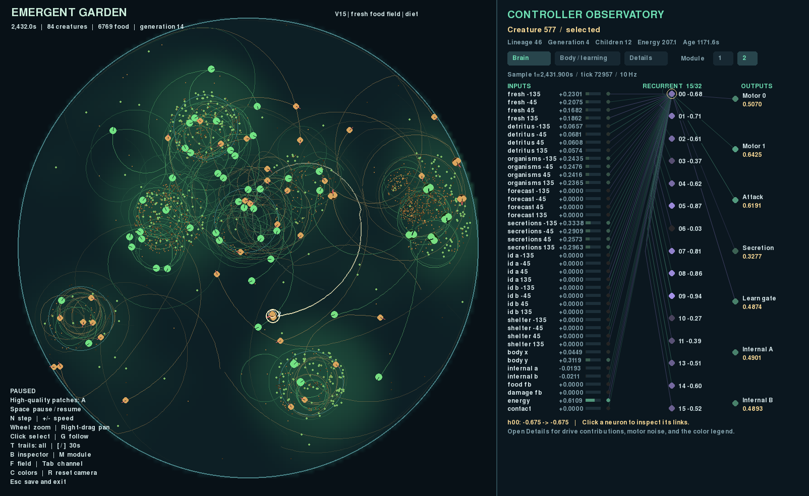

# Emergent Garden

An artificial-life sandbox where creatures forage, grow, reproduce, and evolve
in a continuous 2D world. Each creature is driven by a neural network; survival
and locally acquired energy determine which lineages continue.



- **A changing habitat:** irregular drifting food patches, local depletion and
  recovery, scavenging, predation, and chemical trails.
- **Evolving creatures:** inherited body plans, growing sensor/propulsion modules,
  and mutable neural circuits.
- **Experimental brains:** recurrent state, inherited neuron response times, and
  optional learning within a creature's lifetime.
- **Watch and investigate:** fading trails, a sortable leaderboard, and a live
  inspector showing each creature's senses, neural activations, and actions.

This is an experiment in emergent behavior. Persistent populations and sensory
effects have been observed; reliable adaptive learning and open-ended intelligence
remain research goals.

## Start watching

From the repository directory, with **uv** installed:

```bash
uv sync --locked
uv run garden run --config configs/v16.toml --seed 2 --view --device cpu --seconds 0
```

uv manages Python 3.13 and the dependencies. The Pygame viewer needs a desktop;
a GPU is optional. `--seconds 0` runs until you stop or the population dies out.
Closing the window or pressing Ctrl+C saves the run under `runs/`.

| Control | Action |
| --- | --- |
| Click a creature | Inspect its body and brain |
| Space / `N` | Pause; step one controller interval while paused |
| Mouse wheel / right-drag | Zoom / pan |
| `+` / `-` | Change simulation speed |
| `T` / `G` | Cycle trails / follow the selected creature |
| `L` | Open the leaderboard or return to the inspector |
| Tab / `P` | Cycle field overlays / toggle food-source outlines |
| Home / Escape | Fit the whole dish / save and exit |

See the [usage guide](docs/USAGE.md) for all controls, inspector details, and presets.
Omitting `--config` uses the original V0 defaults.

## Record and resume

Run for an hour of simulated time and record a timelapse without opening a window:

```bash
uv run garden run --config configs/v16.toml --seed 2 --device cpu --seconds 3600 --record --output runs/demo
```

Outputs include `timelapse.mp4`, a preview, metrics, and a resumable checkpoint.
Choose a new output directory for each run. To continue a saved world in the viewer:

```bash
uv run garden run --resume runs/demo/latest.pt --view --device cpu --seconds 0
```

## Explore further

- [Usage](docs/USAGE.md): controls, configuration, recording, checkpoints, and GPU execution.
- [Development](docs/DEVELOPMENT.md): code map, uv workflow, tests, and evaluation tools.
- [Research and plans](planning/README.md): specifications, experiment reports, evidence, and future ideas.
