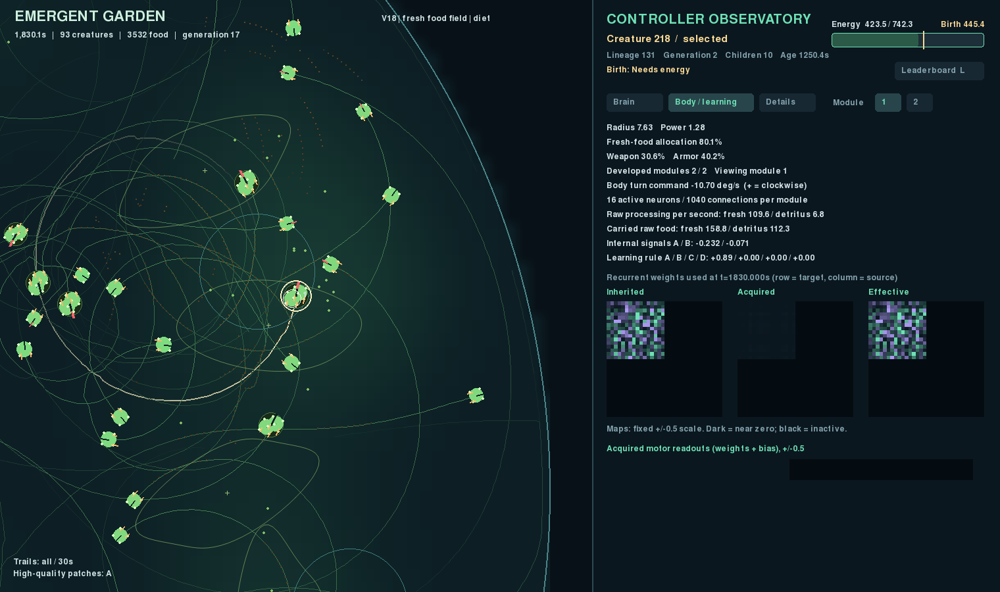
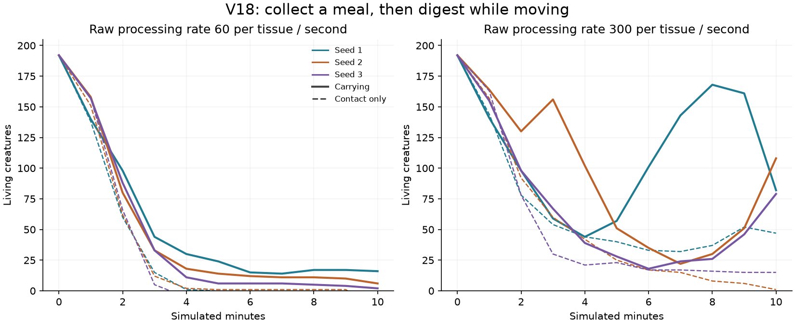

# V18: collect food and digest while traveling

V18 separates food collection from digestion. The motivation is the user's
scarce, valuable meals and inexpensive exploration: a passing creature should
be able to keep a meal after leaving the particle's original position.

## Mechanics and neural interface

- On a feeding tick, touching bodies share available mature food simultaneously.
  Collection fills two separate compartments. Their raw-energy capacities are
  `gut_capacity × digestive tissue × diet allocation`, with fresh-food allocation
  `diet` and detritus allocation `1 - diet`. The tested capacity is 200 per tissue.
  This prevents an unwanted food kind from blocking the other digestive pathway.
- Stored food is processed at the existing finite rate, with the existing diet,
  recycling, quality, attack-investment, and usable-energy storage limits. Picking
  up food does not immediately credit usable energy, food feedback, lifetime
  intake, or reproduction. Digestion can continue while the body moves.
- Food retains its original expiry, readiness, source identity, and producer
  credits. Carrying does not extend shelf life. Source nutritional quality still
  follows the existing reversal law, including for carried food from that source.
- Undigested food follows the carrier. It drops at the last position on death,
  and children start with empty compartments. Digestion deposits recycled food
  at the carrier's current location. Carried food contributes no external odor
  and is hidden in the particle renderer; the HUD counts free particles.
- Carried raw energy remains in the resource ledger and source stock cap until
  consumed, expired, or released. It is not counted again as body energy. V18
  uses float64 raw-food transactions so splitting a meal preserves energy and
  provenance. Equivalent carried packets merge without changing their timers.

Each module now receives **42 inputs**, including `gut_fresh` and `gut_detritus`
fullness in [0, 1]. The other inputs, seven outputs, and recurrent template are
unchanged: up to 32 neurons, initially 16 active, with **5,272 inherited values**.
Both compartments are shared by the body. Capacity follows inherited tissue and
diet; there is not a separate new gut-size gene or a prescribed foraging policy.
The inspector's Body / learning tab shows carried raw food, and the graph shows
the two fullness inputs.



The neutral `gut_capacity = 0` and `no_gut` control both retain the 42-input
interface, with zero fullness readings and contact-only feeding. All four V18
treatments therefore start with exactly matched genomes. V16/V17 founders have
a different input dimension and must not be treated as identical V18 starts.
Explicit genome transfer maps existing input names and adds zero-weight fullness
connections that ordinary mutations can subsequently use. Existing checkpoints
retain their original rules and tensor layouts.

## Completed screening comparisons

These twelve starts keep the user's large habitat, 100-energy food, affordable
movement, drifting sources, and local resource recovery. Only food carrying and
processing rate vary. Each run lasts 600 simulated seconds or ends at extinction.

| Raw processing rate | Carry capacity | Final populations, seeds 1 / 2 / 3 | Births |
| --- | --- | --- | --- |
| 60 | 0 | 0 / 0 / 0 | 0 / 1 / 0 |
| 60 | 200 | 16 / 6 / 2 | 27 / 16 / 8 |
| 300 | 0 | 47 / 1 / 15 | 97 / 37 / 32 |
| 300 | 200 | 82 / 108 / 79 | 411 / 302 / 113 |



At the original rate of 60, the three carrying continuations ended with
populations **94 / 16 / 0** and cumulative births **264 / 42 / 8**. Seeds 1 and 2
reached 1,800 seconds; seed 3 became extinct at 834.4 seconds. Thus carrying alone
improved the short starts without reliably preventing later extinction. The
combined carrying/rate-300 starts are also being extended to 1,800 seconds.

The combined treatment has the strongest short-run establishment in this V18
screen. That supports using it for the next brain comparisons; it does not show
that circling has disappeared or that learning has emerged. The three seeds are
screening evidence, and continued runs are not additional independent replicates.
The [audit](results/v18-carrying.json) checks saved checkpoints, events, matched
founders, resource ledgers, carrier identities, and capacity bounds. Large source
archives and checkpoints stay under `runs/`.

```bash
# Promising combination; your edited V16 preset is preserved.
uv run garden run --config configs/v18-fast-feeding.toml --seed 1 --view --device cpu --seconds 0
# Original processing rate, isolating the carrying mechanic:
uv run garden run --config configs/v18.toml --seed 1 --view --device cpu --seconds 0
```

The local video `runs/v18-carrying-video/timelapse.mp4` records a 120-second fork
of fast-carrying seed 1 from t=600, at 4× playback with fading trails. It is an
illustration, not a new independent trial. The
[verification](results/v18-video.json) decodes all 901 frames.

## Verification and next experiments

All **299 tests pass**, with Ruff lint and formatting checks clean. Tests cover
shared and partial collection, compartment limits, food
readiness and expiry, digestion during travel, odor exclusion, child state,
death/compaction, source caps, credits, replay, and the other feeding controls.
Separate [CPU](results/v18-cpu-carrying.json) and
[RTX 5080](results/v18-cuda-carrying.json) exercises pass exact replay through
food carrying, births, growth, and evolving plasticity rules. The observer remains
passive; all [three inspector tabs fit](results/v18-viewer.json) at heights from
640 to 1,024 pixels. A [brain preview](v18-brain.png) shows the expanded interface.

History auditing now compares parsed configurations rather than TOML bytes:
adding explicit neutral defaults on resume is allowed, while changed world laws
or mismatched recorded physical states still fail.

The user also asked to prioritize neural diversity and within-lifetime learning.
Next are separate comparisons of greater founder circuit variation, more
substantial inherited mutations, and restrained motor learning. Retain matched
frozen-learning controls and measure performance rather than equating changing
paths with intelligence. Simple producer organisms remain a later possibility.

```bash
uv run python scripts/audit_carrying.py
uv run python scripts/plot_carrying.py
```
