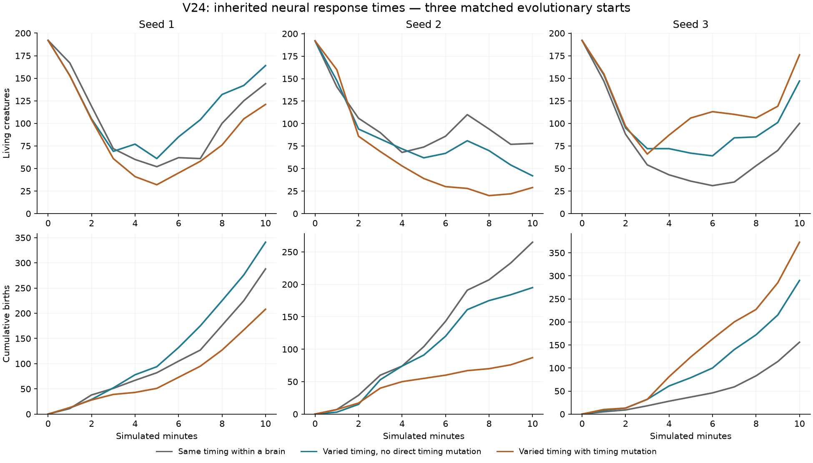
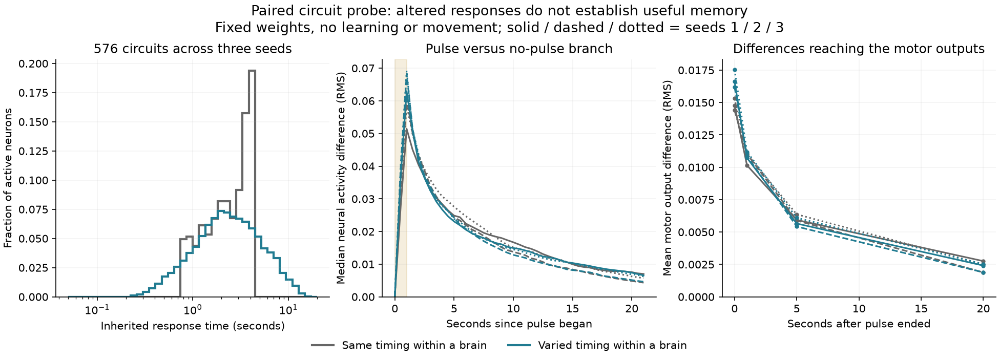
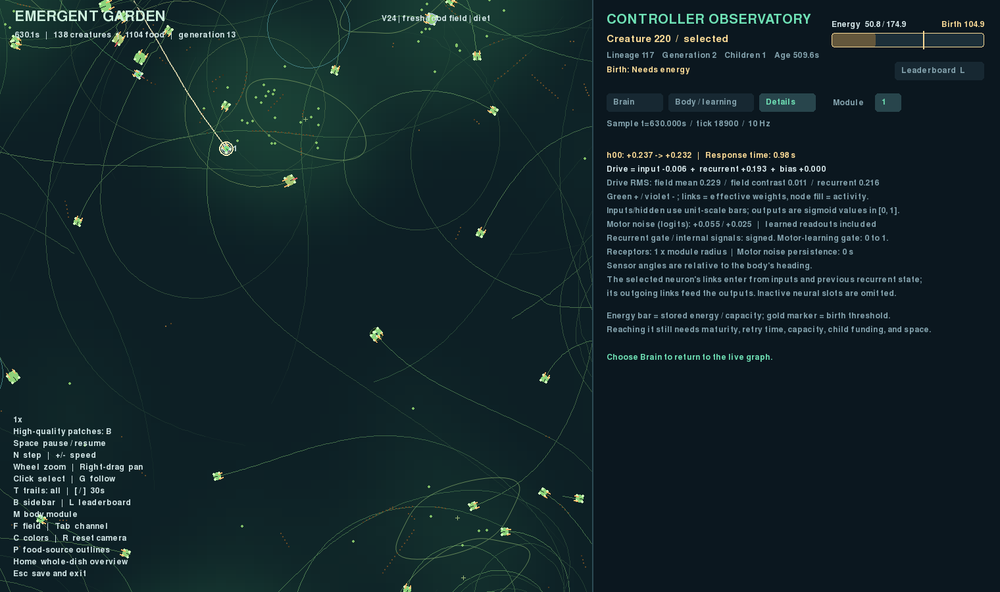

# V24: inherited neural response times

V24 / package 0.25.0 lets individual neurons inherit different response times.
The initial ecological comparison is mixed: varying timing improves births in
two of three starts, while adding direct timing mutation improves only one.
The mechanism adds another source of neural and behavioral variation; useful
temporal memory has not been demonstrated.

All twelve 600-second pilots and the separate paired pulse probe are complete.
Nine exact continuations to 1,800 seconds are in progress. They extend every
seed of the three treatments, without selecting only successful populations.
The [prospective plan](NEURAL_TIMESCALES_PLAN.md) records this decision.

## What changes

Previously, every recurrent neuron within a body shared its inherited
`memory_tau`. Different creatures could have different time constants. Now
each hidden slot has an additional inherited timing gene:

```text
body_tau = .2 + 4.8 * sigmoid(body trait 5)
tau_i = body_tau * exp(log(neural_timing_range) * tanh(timing_gene_i))
alpha_i = 1 - exp(-controller_dt / tau_i)
h_i = (1-alpha_i) * h_i + alpha_i * tanh(input + recurrent drive + bias)
```

This is a leaky recurrent rate network, with faster and slower units in the
same circuit. It is not a spiking model. The 42 inputs, seven outputs, 32-slot
template, and all existing weight and trait offsets are unchanged. Founder
widths still range from 8 to 24 active neurons, with 50% expected recurrent
connectivity. The genome grows from **5,272 to 5,304** values. Body modules
share the inherited timing genes but retain their own neural and learned states.

The [heterogeneous-neuron study by Perez-Nieves et al. (2021)](https://www.nature.com/articles/s41467-021-26022-3)
motivated this experiment. It concerns trained spiking networks and reports
benefits on temporally structured tasks. Those models and their training differ
from this evolved ecology; the result does not establish a benefit here.

| Parameter | Neutral default | Heterogeneous preset |
| --- | ---: | ---: |
| `neural_timing_range` | 1 | 4 |
| `initial_timing_sigma` | 0 | .5 |
| `timing_mutation_probability` | 0 | .1 in `v24.toml`, 0 in `v24-inherited.toml` |
| `timing_mutation_sigma` | .15 | .15 |
| Existing inherited-value bound | ±3 | ±3 |

Timing range 4 permits factors between approximately one quarter and four times
the body time constant. The configured gene bound makes the endpoints slightly
narrower. Range 1 follows the exact earlier integration arithmetic. Configuration
accepts ranges 1–100; the experiment uses 4. The 576 tested founders have active
response times spanning approximately .24–16 seconds, versus .78–4.43 seconds
in the homogeneous comparison.

Founder timing genes use a separate random stream, seeded by `seed + 6700417`.
The same stream supplies direct timing mutations and is saved in checkpoints.
It does not perturb food, placement, ordinary weight mutation, or structural
mutation draws. Mutations are independent Gaussian perturbations of selected
timing genes, clipped to the inherited-value bound. No movement policy or
foraging weights are prescribed.

Timing changes remain inherited. Neural activity, recurrent plasticity, motor
readouts, and optional value readouts still reset at birth. Neuron duplication
copies the donor's timing gene before splitting outgoing influence, preserving
the existing fixed-weight recurrent-function guarantee. Dormant timing genes do
not affect activity or the reported timing distributions. Direct timing mutation
is disabled alongside other mutation in fixed-genotype assays and challenges.

Transfers from older genomes append zeros, which express the original body time
constant. V24 transfers into wider templates preserve existing timing genes;
additional slots remain dormant. Old checkpoints retain their original version
and genome layout when resumed. Timing mutations do not count as neuron/edge
structural births.

Neuron/synapse construction and maintenance charges remain unchanged. The first
screen adds no separate storage or computation cost for the timing genes.

## Matched ecological screen

The reference is the viable [V22 preset with its value head disabled](../configs/v22-baseline.toml).
It retains gentle within-lifetime motor learning, independent exploration,
carried meals, scarce valuable food, and inexpensive travel. It does not combine
new timing with an unproven critic treatment. The user's working V16 file is
untouched.

All three timing treatments start from **identical full genomes within each
seed**, including timing genes. The homogeneous treatment carries them without
expressing their variation. The no-direct-timing-mutation treatment still has
body-trait, ordinary weight, and structural mutations, including timing copied
by neuron duplication. Selection and reproduction continue in all treatments.

| Treatment | Population at 600 s, seeds 1 / 2 / 3 | Births at 600 s |
| --- | --- | --- |
| Homogeneous, `v24-baseline.toml` | 144 / 78 / 100 | 288 / 265 / 156 |
| Varied timing, `v24-inherited.toml` | 164 / 42 / 147 | 341 / 195 / 290 |
| Varied timing with mutation, `v24.toml` | 121 / 29 / 176 | 208 / 87 / 373 |



Varied timing increases both births and fresh-food absorption in seeds 1 and 3,
and reduces them in seed 2. Direct timing mutation reduces births relative to
the no-direct-mutation treatment in seeds 1 and 2, and increases them in seed 3.
No treatment establishes a general advantage. These are evolving communities;
differences combine behavior, selection, reproduction, and later mutations.

Variation remains expressed after 600 seconds: mean within-brain log-time
standard deviations are .519/.516/.608 without direct timing mutation and
.551/.533/.581 with it. The homogeneous treatments have zero. These summarize
log seconds over active neurons within each body, then weight bodies equally.
Other timing means, standard deviations, minima, and maxima count each active
neuron once per organism, without multiplying by its body-module count.

There is already a strong lineage bottleneck in inherited-timing seed 1: only
one founder lineage remains at 600 seconds. More births do not imply greater
genetic diversity. The nine ongoing continuations will include lineage and
trophic composition as well as persistence and reproduction.

Multiplicative timing variation also changes a brain's average response speed.
Thus these treatments do not isolate within-brain heterogeneity from mean speed.
No claim of improved memory or adaptive learning follows from the pilot counts.

## Separate pulse-response diagnostic

For each of three seeds, 192 matching founder circuits receive a constant energy
observation of .5 for five seconds. One branch then receives a .6 fresh-food
signal at all four receptors for one second; its paired control gets no pulse.
Both then run for 20 further seconds. Homogeneous and heterogeneous treatments
use the same inherited weights and body time constants. The probe has no moving
body, acquired learning, exploration, reproduction, or task reward.



Heterogeneous timing increases mean activity differences at the pulse's end
from .0644/.0687/.0664 to .0732/.0766/.0747 RMS. Differences also reach motor
outputs. At 20 seconds after the pulse, neural differences are smaller in two
seeds and slightly larger in the third. The probe confirms altered response
dynamics; it shows no consistent increase in retained activity, and does not
test whether any retained information is useful.

The [compact record](results/v24-pulse-responses.json) includes source hashes,
matched-founder checks, binned response times, pulse-end/follow-up summaries,
and curves sampled at 2 Hz. Full controller-rate curves and genomes remain in
`runs/v24-pulse-responses`.

## Verification and observation

All **408 tests** and repository-wide Ruff checks pass, including the final
inspector correction and its disabled-learning controls.
Mechanical cases cover analytical step and decay responses, finite bounded
integration, dormant slots, duplication, neutral transfers, wider templates,
mutation isolation, birth state reset, statistics weighting, and exact resume.

All three fully neutral V24 pilots match V22's common final state, events, and
physical measurements exactly. All three homogeneous pilots also match the
fully neutral V24 trajectories despite carrying random, unexpressed timing
genes. Comparisons exclude only version metadata, new genes and their RNG,
derived timing summaries, total-genome variance, and full-genome digests.
Their original gene prefixes and all other physical state must match exactly.
The twelve-run [audit](results/v24-neural-timing.json) also verifies source
archives, energy/resource/trophic accounting, and checkpoint measurements.

Separate [CPU](results/v24-cpu-timing.json) and
[RTX 5080](results/v24-cuda-timing.json) exercises pass exact device-local replay.
They include 5 births / 3 growth events on CPU and 6 births / 9 growth events on
CUDA, with changing signed plasticity rules. This does not assert identical
trajectories across CPU and CUDA.

The observer uses the actual integration factor for each neuron. Details shows
the selected neuron's inherited response time on the existing activity line,
without adding a row. Disabled value prediction no longer appears as a zero
forecast. All three inspector tabs fit at heights 640–1,024 pixels.



The [viewer record](results/v24-viewer.json) comes from a 30-second illustrative
fork of mutation seed 1, not another independent ecological experiment.

## Reproduce and inspect

```bash
uv run garden run --config configs/v24-inherited.toml --seed 3 --view --device cpu --seconds 0
uv run garden run --config configs/v24.toml --seed 3 --view --device cpu --seconds 0
```

Use `v24-baseline.toml` for homogeneous expression with matching random timing
genes, and `v24-neutral.toml` for zero timing genes and historical compatibility.
Click a creature and a neuron, then choose Details to see its response time.

The pilot commands are `garden calibrate --seeds 1 2 3 --seconds 600 --device cpu`
with each of these presets and a fresh output path. Recorded batches are
`runs/v24-{neutral,homogeneous,inherited,evolving}-pilot`.

```bash
uv run python scripts/probe_neural_timing.py --output runs/my-timing-probe
uv run python scripts/audit_neural_timing.py
uv run python scripts/plot_neural_timing.py
uv run python scripts/verify_device.py --config configs/v24.toml \
  --output runs/my-timing-cpu --device cpu --exercise-births --exercise-growth --exercise-rules
uv run pytest -q
uv run ruff check .
```

The auditor uses the recorded batch paths above. After all nine continuations
complete, `--include-long` adds their full histories and accounting checks.
Each continuation resumes its 600-second checkpoint with `--seconds 1200`, into
`runs/v24-{homogeneous,inherited,evolving}-long-{1,2,3}`. New source archives and
original resume provenance remain attached to each segment.
