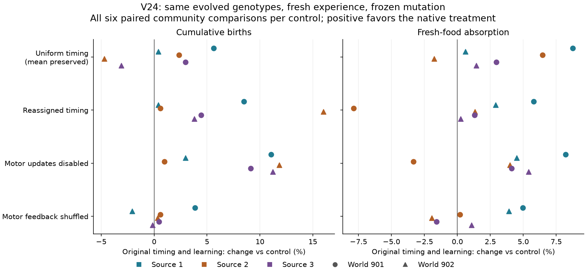
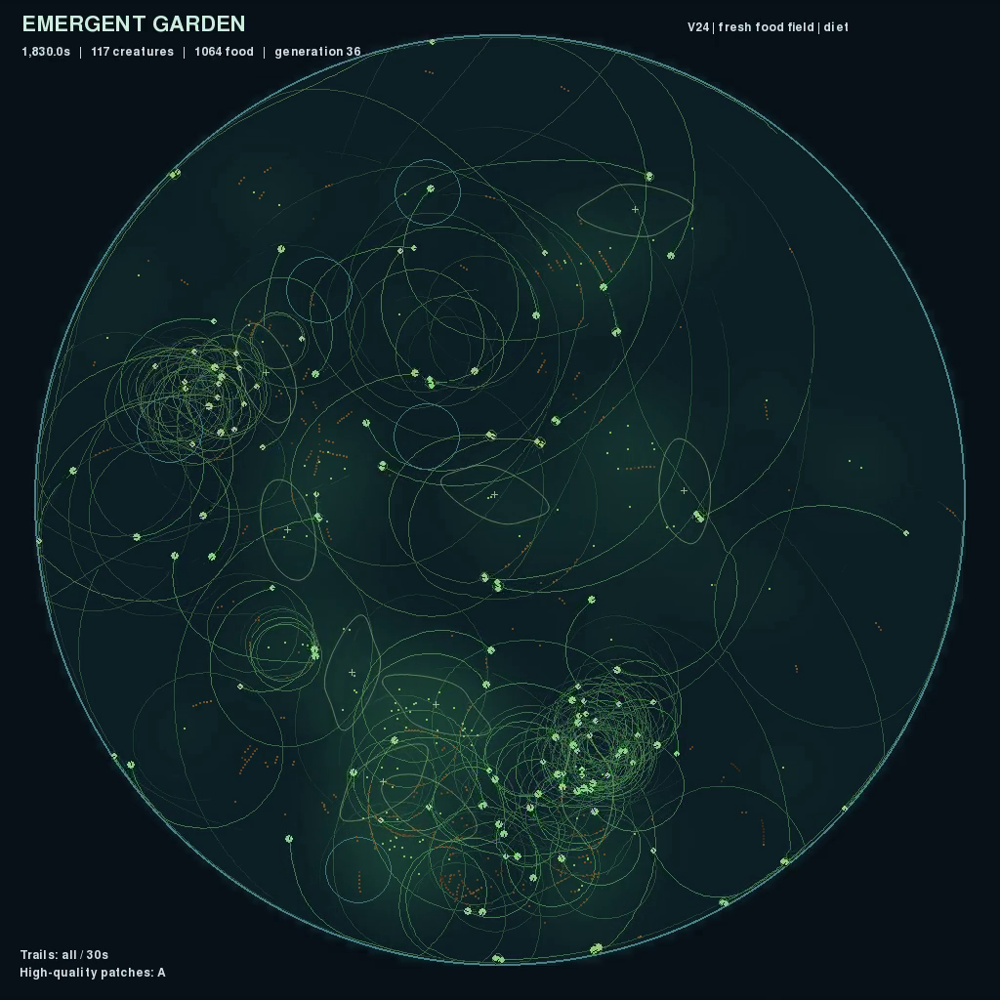

# V24: controlled timing and learning comparisons

All thirty prospective community trials are complete and audited. Keeping the
original timing assignment yields more births than reassigning the same time
constants in **all six matched comparisons**. Motor learning also yields more
births than disabling its updates in all six. Its advantage over shuffled
feedback is mixed and often small, so useful adaptive credit assignment remains
unestablished beyond these conditional comparisons.

The results support retaining `v24-inherited.toml` as the starting ecology for
the next recurrent-learning experiment. They do not establish useful temporal
memory or general intelligence. The current trail image still contains many
looping routes and concentrations around food sites.

## Design

The [plan](NEURAL_TIMING_ASSAY_PLAN.md) was recorded before launch. Use all three
inherited-timing populations at 1,800 seconds, sample 192 living descendant
genomes with replacement, and transplant them into environments 901 and 902.
For each source/environment pair, five treatments share the sampled genotypes
and complete initial physical world. All acquired state starts fresh. Each
trial runs for 360 seconds; every population survives to that endpoint.

- **Native:** original timing and motor learning.
- **Uniform:** each brain's active neurons share its original arithmetic mean
  time constant. Other genes and dormant timing genes stay unchanged.
- **Reassigned:** permute the original active timing genes among neuron slots,
  preserving their full multiset. A genotype-keyed random stream gives identical
  clones identical interventions, independently of pool order.
- **Motor off:** original timing and exploration, with motor updates disabled.
- **Feedback shuffled:** original timing and learning, with energetic return
  rates assigned from other bodies updating in the same batch.

All six mutation probabilities are zero, including timing mutation. Births,
deaths, competition, development, and selection continue. Both learning controls
retain the older recurrent plasticity rule and learning-capacity charges.
Shuffling cannot mix singleton batches and retains population-wide signals.

The sources have only 1/2/1 historical founder lineages, but contain
**273/124/289 distinct complete genotypes**. A shared founder does not mean the
descendants have identical genomes; unique genotype counts also do not measure
functional diversity. Assay lineage labels identify newly sampled founders,
including separate copies of a sampled genotype, not original ancestry.

## All matched results

Cumulative births, with all treatments and both environments retained:

| Source | World | Native | Uniform | Reassigned | Motor off | Feedback shuffled |
|---|---|---:|---:|---:|---:|---:|
| 1 | 901 | 563 | 533 | 519 | 507 | 542 |
| 1 | 902 | 519 | 517 | 517 | 504 | 530 |
| 2 | 901 | 519 | 507 | 516 | 514 | 516 |
| 2 | 902 | 587 | 616 | 506 | 525 | 585 |
| 3 | 901 | 657 | 638 | 629 | 602 | 654 |
| 3 | 902 | 685 | 707 | 660 | 616 | 686 |

Number of the six comparisons in which native exceeds each control:

| Control | Births | Fresh-food absorption | Final population |
|---|---:|---:|---:|
| Uniform, mean preserved | 4 / 6 | 5 / 6 | 3 / 6 |
| Reassigned timing | 6 / 6 | 5 / 6 | 2 / 6 |
| Motor updates disabled | 6 / 6 | 5 / 6 | 3 / 6 |
| Motor feedback shuffled | 4 / 6 | 4 / 6 | 4 / 6 |



Reassignment reduces births relative to native by varying amounts: native's
advantage ranges from **0.39% to 16.01%** when expressed relative to the control.
Disabling motor updates gives a native birth advantage of **0.97–11.81%**.
The shuffled-feedback birth contrasts span **−2.08% to +3.87%**, with several
differences of only one to three offspring. These small differences and the
mixed fresh-food effects warrant caution about the learning mechanism.

More births do not consistently mean a larger endpoint population. For example,
native beats reassignment for births in all six comparisons but for endpoint
population in only two. The [full record](results/v24-timing-assays.json) retains
population, deaths, all food sources, timing and learning statistics, and
accounting diagnostics, alongside every paired contrast.

Uniform timing controls the arithmetic mean intrinsic time constant, not the
mean integration factor or the recurrent circuit's relaxation modes. Its mixed
results do not isolate a generic benefit of heterogeneity. Reassignment is a
stronger distribution-preserving intervention, but also perturbs circuits
selected under their original timing assignment. The result is specific to
these evolved communities and two new habitats per source. The six pairs share
three source populations; creatures, offspring, and pairs from the same source
are not independent evolutionary replicates. No significance claim is made.

## Verification and movement preview

The audit verifies source-checkpoint and pool hashes, reproducible sampling,
the archived assay script and native sources, exact common initial physical
states, fresh acquired state, frozen configurations, all birth genome digests,
and full final-genotype membership in each initial pool. Every final state
matches its saved metrics and event counts; energy, fertility, carried-food,
and trophic accounting checks pass.

Uniform timing changes every active timing gene in these samples. Permutation
changes about **95–96%** of active timing genes; no circuit is an untouched
permutation control. Non-timing and dormant genes remain exact. Each brain's
mean response time is preserved within **9.54e-7 seconds** in the tested
float32 calculations. The full timing multiset is exact under permutation.

A separate 30-second illustrative fork of inherited-timing source 2 starts at
1,800 seconds. Its [local video](../runs/v24-inherited-real-time-preview/timelapse.mp4)
runs at **1× simulated speed**, with one frame per physics step, 30 FPS, and
30-second fading trails. All 901 frames decode successfully. The complete final
simulation state matches a plain replay exactly after draining the event queue
that the run store already recorded. This fork is not another experimental
replicate. The [verification record](results/v24-real-time-preview.json)
includes hashes, source archives, replay result, and accounting.



The trail image shows many loops as well as longer routes across the dish.
Reproduction and food uptake have improved in some comparisons, but that image
does not demonstrate purposeful searching. The next native experiment needs
behavioral inspection alongside its population measures.

## Reproduce

```bash
uv run python scripts/assay_neural_timing.py \
  --source runs/v24-inherited-long-1 --output runs/my-timing-assay-1 \
  --seeds 901 902 --seconds 360 --device cpu
uv run python scripts/audit_timing_assays.py
uv run python scripts/plot_timing_assays.py
uv run garden run --resume runs/v24-inherited-long-2/latest.pt \
  --output runs/my-real-time-preview --device cpu --seconds 30 \
  --record --video-speed 1
```

Repeat the assay for sources 2 and 3. The auditor defaults to the recorded
`runs/v24-timing-assay-{1,2,3}` paths; pass `--assays` for different output roots.
The three original batches exited successfully and should not be restarted.
All **414 tests** and Ruff checks pass. Dependencies remain managed with uv.

The next [V25 plan](RECURRENT_LEARNING_PLAN.md) adds optional acquired recurrent
credit, supported by completed [independent diagnostics](RECURRENT_LEARNING_RESEARCH.md).
Its native implementation has not started; the research loop remains active.
