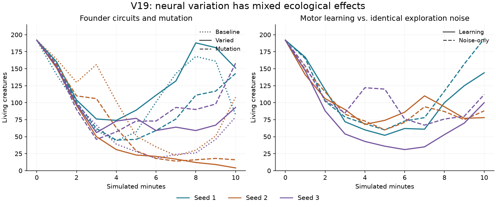
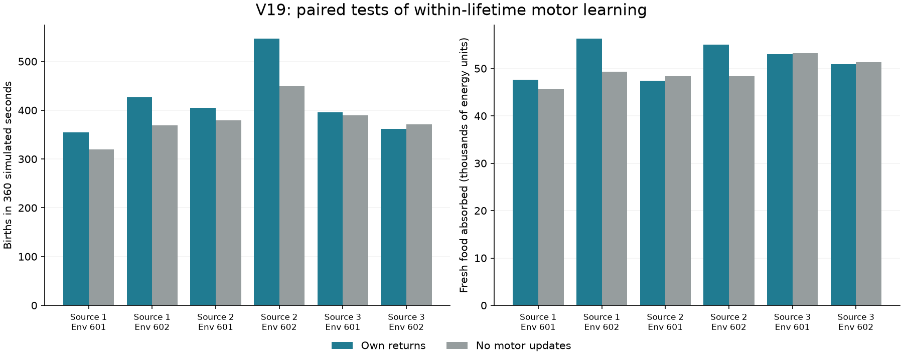

# V19: varied founder circuits and controlled learning experiments

The aim is to make more neural strategies available to evolution while testing
whether they help creatures find food and reproduce. The habitat retains V18's
rare, valuable meals, inexpensive propulsion, finite carrying, and faster
processing. The user's working `configs/v16.toml` remains untouched.

## What changes

`configs/v19.toml` draws each founder's active neuron count uniformly from 8–24
and enables each possible recurrent connection with probability 0.5. Inputs and
outputs initially connect to all active neurons. These are different bounded
recurrent graphs, **not extra stacked hidden layers**. The shared body-module
template still has 42 inputs, seven outputs, 32 available neurons, and 5,272
inherited values. Existing structural mutations can subsequently explore 4–32
active neurons.

The new settings are `initial_neuron_spread = 8` around `initial_neurons = 16`,
and `initial_recurrent_density = 0.5`. Neutral defaults (0 and 1) preserve the old
founders. An independent, checkpointed random stream chooses their structures
without moving food, changing bodies, or consuming the other random streams.

Founder recurrent weights use standard deviation `1/sqrt(max(1, N*density))`;
output weights use `1/sqrt(N)`. This controls expected input variance across
widths and densities. Input weights retain their previous scaling and biases
start at zero. No preferred movement is encoded. **Birth does not redraw or
rescale the parent's circuit.** Children inherit its genes and masks with the
configured mutations; activations, traces, and acquired synaptic changes start
empty. Existing construction and maintenance costs charge expressed circuitry.

The presets separate three questions:

| Preset | Founder graphs | Weight mutation | Node / edge mutation | Motor exploration / learning |
|---|---|---|---|---|
| `v19-baseline.toml` | 16 neurons, dense | probability .02, sigma .05 | .05 / .1 | No exploration |
| `v19.toml` | 8–24 neurons, half recurrent edges | .02, .05 | .05 / .1 | No exploration |
| `v19-mutation.toml` | Same varied founders | .04, .1 | .2 / .4 | No exploration |
| `v19-learning.toml` | Same varied founders | .02, .05 | .05 / .1 | Sigma .05–.15; learning rate at most .01 |

Mutation probabilities retain their existing meanings: weight changes are
per inherited neural value; node/edge probabilities govern the structural
mutation attempts for each child. Body-trait and body-module mutation settings
are unchanged.

The learning preset reduces the acquired motor-row norm limit from .5 to .15
and the maximum motor-learning rate from .2 to .01. Normalized features bound
the learned correction to each motor logit by .15. The existing energetic
reinforcement rule keeps a two-second eligibility trace, a ten-second reward
baseline, and a 120-second decay half-life. These are tentative settings, not
an established optimum. Recurrent plasticity remains active in all presets.

The paired learning control uses the **same preset and exploration noise
settings**, with `--ablation no_motor_learning`. It disables acquired motor
updates, retains recurrent plasticity, and still pays for its inherited
learning capacity. This distinguishes the effect of motor updates from merely
adding noise. `no_plasticity` disables both learning mechanisms and is a
different intervention.

## Completed screening

Each treatment has three fresh 600-second runs, seeds 1/2/3. Within each seed,
all four varied-founder treatments have exactly identical inherited genomes.
The baseline differs in initial graph and its weight scaling. Consequently the
baseline comparison measures their combined effect, not graph shape alone.

| Treatment | Living at 600 s (seeds 1 / 2 / 3) | Cumulative births |
|---|---|---|
| Baseline | 82 / 108 / 79 | 411 / 302 / 113 |
| Varied founders | 151 / 4 / 93 | 455 / 26 / 195 |
| Stronger mutation | 143 / 16 / 158 | 262 / 116 / 297 |
| Gentle motor learning | 144 / 78 / 100 | 288 / 265 / 156 |
| Same noise, motor learning disabled | 194 / 88 / 112 | 367 / 264 / 310 |



Varied founders improved two starts and weakened another. Stronger mutation
also had mixed effects. Motor learning did not provide a consistent advantage:
its birth counts were lower in two starts and essentially tied in the third.
These small screens justify continued comparisons, not a claim of improved
intelligence or a general winner.

All three varied-founder starts were continued to 1,800 seconds. Populations
were **251 / 34 / 327**, births **2,413 / 237 / 2,198**, and maximum living
generations **40 / 25 / 41**. Seed 2 recovered from its early four-creature
bottleneck. These are continuations, not three additional independent starts.
The stronger-mutation continuations ended with populations **162 / 0 / 363**
and births **1,681 / 116 / 2,593**. Seed 2 became extinct at 771.13 seconds.
Stronger mutation therefore did not provide a reliable improvement.

The learning and noise-only populations also all reached 1,800 seconds:

| Treatment | Living creatures (seeds 1 / 2 / 3) | Births | Maximum living generation |
|---|---|---|---|
| Gentle learning | 235 / 125 / 274 | 1,727 / 994 / 1,563 | 42 / 33 / 38 |
| Same noise, motor updates disabled | 393 / 117 / 270 | 2,900 / 1,188 / 1,832 | 66 / 33 / 38 |

Learning had fewer cumulative births in all three of these evolutionary runs.
The descendant populations differ genetically, so these endpoints do not isolate
an individual's learning response. The same-genotype tests below address that.

The [audit](results/v19-circuits.json) verifies the checkpoint against recorded
measurements, birth/death events, carrying constraints, and energy/resource
ledgers. With neutral settings, **all recorded physical measurements and the
complete final physical state match V18 exactly** for all three 600-second runs.
Only the versioned configuration and unused founder-structure RNG differ.

## Same-genotype learning transplants

All three learning populations saved at 600 seconds were sampled into two fresh
environments (seeds 601/602). Each pair starts with the same 192 descendant
genotypes, placement, food, inherited capacities, and exploration settings.
Mutation is disabled and acquired neural state starts empty. Recurrent
plasticity remains active when motor learning is disabled.

| Source / environment | Births with learning | Births without motor updates | Difference in fresh-food energy absorbed |
|---|---|---|---|
| 1 / 601 | 355 | 320 | +1,990 |
| 1 / 602 | 427 | 369 | +6,958 |
| 2 / 601 | 405 | 379 | −961 |
| 2 / 602 | 547 | 449 | +6,647 |
| 3 / 601 | 396 | 390 | −218 |
| 3 / 602 | 362 | 371 | −424 |



Births increase in five of six comparisons, while fresh-food intake increases in
three. Effects depend on source and environment, and some differences are small.
This supports a conditional ecological effect from motor updates, not a general
learning advantage or proof of adaptive credit assignment. The
[18-transplant audit](results/v19-learning-assays.json) includes the six founder
reference runs; these are community outcomes, not independent per-agent fitness.

A stronger follow-up assigns each learner another creature's normalized return
rate while preserving its actual food and energy. These shuffled-return runs
are still in progress. They test whether the relationship between a creature's
own actions and outcomes matters; shared environmental information can remain
useful even when returns are shuffled. See [the control's mechanics](SENSOR_RADIUS.md).

## A diagnostic for circling

`scripts/probe_food_response.py` exposes sampled inherited circuits to uniform,
left-rich, and right-rich food inputs at the same mean intensity. It starts
neural state empty, disables plasticity/noise, holds energy at half capacity,
and averages motor outputs over seconds 20–25. The directional readout is half
the right-rich minus left-rich motor imbalance. This separates a response to
food direction from steady turning in a uniform field.

For fresh-food mean .4 and a ±.02 side contrast:

| Selected source | Median absolute uniform turn | Median absolute directional response | Positive directional sign |
|---|---|---|---|
| V18 fast carrying, seed 1, 1,800 s | .0787 | .0010 | 7 / 57 |
| V18 fast carrying, seed 2, 1,800 s | .1308 | .0091 | 64 / 64 |
| V19 varied founders, seed 1, 600 s | .0571 | .0014 | 61 / 64 |
| V19 stronger mutation, seed 1, 600 s | .1470 | .0018 | 45 / 64 |

The second V18 population has a larger, consistently aligned inherited
response, whereas steady turning dominates the small response in several other
samples. This is consistent with uneven evolution of directional sensitivity;
it does not establish its ecological usefulness. The assay omits body geometry,
other observations, and acquired state. Sampled descendants share ancestry and
are not independent evolutionary replicates. Raw responses at three intensities
for fresh food and detritus, founder comparisons, genotype hashes, and source
provenance are retained in [the diagnostic record](results/v19-food-response.json).

## Delayed-credit diagnostic

A separate constructed cue/action test supplies one feature, receives an
squared-error return after a controlled delay, and reverses the required mapping
halfway through. Each condition has 64 circuits, 200 choices per mapping, and
three random seeds. Intervening inputs and exploration are zero. With learning
disabled, the deterministic squared error is .25.

| Outcome delay | Eligibility time constant | Late error before reversal | Late error after reversal |
|---|---|---|---|
| .1 s | 2 s | .24380 | .24593 |
| .1 s | 10 s | .24881 | .24624 |
| 5.1 s | 2 s | .24982 | .24979 |
| 5.1 s | 10 s | .24918 | .24914 |
| 20.1 s | 2 s | .25000 | .24999 |
| 20.1 s | 10 s | .24994 | .24992 |

Adaptation is small with these deliberately bounded motor changes, and very
weak at longer delays. A longer eligibility trace alone does not solve this
constructed problem. Reward timing, the moving baseline, readout decay, and
noise all contribute; this does not isolate the cause of an ecological failure.
The [36 trial records](results/v19-delayed-credit.json) retain both noisy and
deterministic readouts and exact sources. Run with:

```bash
uv run python scripts/probe_delayed_credit.py --output runs/my-delayed-credit
```

The [live-controller preview](v19-learning-brain.png) follows the first learning
population for 30 additional seconds after its 1,800-second checkpoint. Trails
show both loops and wider excursions. It is illustrative, not a new replicate.

## Verification and use

All 310 tests pass, including variable founder graphs, weight scaling,
inheritance, fresh child neural state, unchanged legacy trajectories, observer
purity, and the directional diagnostic. Ruff checks pass. Separate
[CPU](results/v19-cpu-circuits.json) and
[RTX 5080](results/v19-cuda-circuits.json) checks passed exact checkpoint replay
through births, growth, changing rules, and motor learning. They verify
mechanics, not useful learning.

```bash
uv run garden run --config configs/v19.toml --seed 1 --view --device cpu --seconds 0
uv run garden run --resume runs/v19-varied-long-1/latest.pt --view --device cpu --seconds 0

uv run garden calibrate --config configs/v19-learning.toml --seeds 1 2 3 \
  --seconds 600 --device cpu --output runs/my-learning-pilot
uv run garden calibrate --config configs/v19-learning.toml --seeds 1 2 3 \
  --ablation no_motor_learning --seconds 600 --device cpu --output runs/my-noise-control

uv run python scripts/audit_circuits.py --long-treatments varied mutation learning noise-only
uv run python scripts/plot_circuits.py
uv run python scripts/probe_food_response.py runs/v19-varied-long-1 \
  --genomes 64 --output runs/my-food-response
```

## Next questions

The priority is to distinguish exploration, inherited searching, and useful
within-lifetime adaptation. The completed fresh-environment transplants and longer runs distinguish
within-lifetime effects from divergent evolutionary histories. Shuffled returns
provide the next control for the conditional benefits observed so far.

One possible limitation is delayed credit: food search can take longer than the
current two-second eligibility trace. Another is a weak spatial signal compared
with intensity and inherited turning bias. Neither is established as the cause.
Measure these before adding depth or simply enlarging networks.

Reward-modulated recurrent learning can solve constructed tasks with delayed
rewards in [Miconi (2017)](https://elifesciences.org/articles/20899). Evolution of
plastic controllers across a family of cognitive tasks can also produce
transfer to withheld tasks in [Miconi (2023)](https://proceedings.mlr.press/v202/miconi23a.html).
Those results motivate explicit credit-assignment and held-out tests; they do
not demonstrate that the same capabilities will emerge in this ecology.
