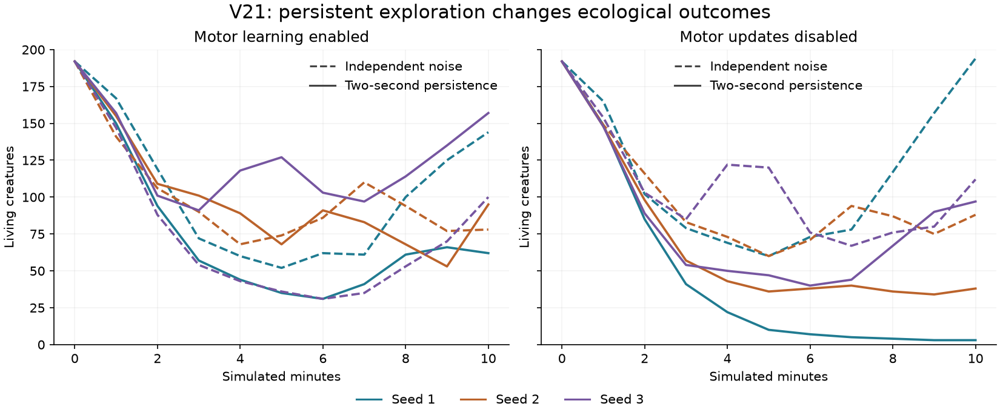
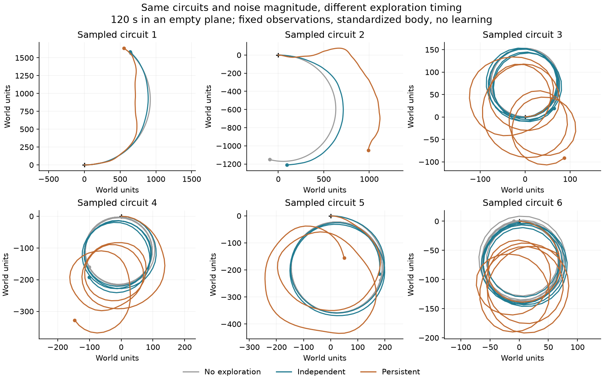

# V21: persistent exploratory motor changes

V21 tests whether random exploratory motor commands should persist long enough
to alter a creature's route. It retains the sparse V19 learning habitat, receptor
radius 1, varied inherited circuits, and ordinary mutation. The user's working
`configs/v16.toml` remains untouched. The [initial plan](COHERENT_EXPLORATION_PLAN.md)
records the hypothesis and controls.

## Mechanism

`motor_noise_tau = 2` gives exploration a two-second correlation time. Zero is
the default and reproduces the previous independent-noise policy. This setting
requires V21 or later when nonzero. It changes exploration timing, without
prescribing a steering direction or changing inherited weights.

For each module, let `f` be normalized hidden activity plus bias, `b` the two
inherited motor logits, `P` the acquired motor readout, and `z_previous` its last
sampled motor logits. Both means below use the **current** acquired weights:

```text
rho = exp(-elapsed / motor_noise_tau)
mu = b + P f
mu_previous = b_previous + P f_previous
innovation_std = sigma sqrt(1 - rho²)
z = mu + rho (z_previous - mu_previous) + innovation_std epsilon
motors = sigmoid(z)
```

The first sample uses `rho = 0`, so it starts at the full stationary variance.
With fixed readout weights, changing inherited logits does not accidentally
smooth the inherited controller's response. Noise has the existing inherited
standard deviation of .05–.15. Independent standard-normal innovations come
from the same checkpointed exploration stream as before.

The conditional likelihood score for an acquired motor connection is:

```text
(epsilon / innovation_std) outer (f - rho f_previous)
```

Both current and previous mean evaluations matter. This follows the first-order
autoregressive-policy formulation of
[Korenkevych et al. (2019)](https://www.ijcai.org/proceedings/2019/0382.pdf).
The score is checked against finite differences of this policy's log-likelihood.
The full learning rule still includes modulation, eligibility decay, a temporal
reward baseline, and bounded updates; it is an approximation, without a
convergence guarantee. Stationary-variance claims apply to fixed acquired
weights, not arbitrary simultaneous online updates.

Previous features, inherited logits, sampled logits, and readiness are stored
per module. They are lifetime state: checkpoints retain them, while newborns
and newly grown modules start empty. Explicitly disabling exploration removes
the historical perturbation immediately. `motor_noise_rms` reports the actual
applied perturbation, including its history contribution. The observer shows
that same value; [Details](v21-details.png) states the persistence time.

The genome remains **5,272 inherited values**, with **42 inputs, seven outputs,
and up to 32 active recurrent neurons** per module. There are no additional
genes, layers, body parts, sensory inputs, or energetic costs in this version.

## Ecological comparison

Four groups cross independent versus persistent exploration with motor learning
enabled or disabled. All groups use exactly matching founder genomes within
each seed. Recurrent plasticity and inherited learning-capacity costs remain
enabled. The disabled-motor control is `no_motor_learning`, not `no_plasticity`.

The pilots cover three independent 600-second starts per treatment. Longer
follow-ups continue all three persistent-exploration starts in both learning
conditions. These continuations are extensions, not additional replicates.
Population and birth counts can differ because the resulting genomes and
environments diverge; they do not isolate adaptive learning in a fixed genotype.

All 12 pilots are complete:

| Exploration / motor updates | Population at 600 s (seeds 1 / 2 / 3) | Births |
|---|---|---|
| Independent / enabled | 144 / 78 / 100 | 288 / 265 / 156 |
| Independent / disabled | 194 / 88 / 112 | 367 / 264 / 310 |
| Persistent / enabled | 62 / 95 / 157 | 128 / 314 / 365 |
| Persistent / disabled | 3 / 38 / 97 | 10 / 102 / 160 |



Persistence increases births in two starts with learning enabled, but reduces
them in all three without motor updates. Learning produces more births than
its disabled control in all three persistent-noise starts. This is an effect
of the mechanism in these evolving communities, not yet evidence that it learned
a useful association. The six independent-noise runs match every recorded
common physical measurement and the complete common final state of V19 exactly;
only the versioned configuration, new history tensors, and noise telemetry differ.

The [audit](results/v21-exploration.json) verifies those matches, all founder
genomes, checkpoint/measurement agreement, birth/death events, carrying limits,
neural bounds, and energy/resource ledgers. The first persistent noise-only
continuation became extinct at 1,397.63 seconds; longer follow-ups are still
running. Fresh-environment assays with matched descendant genomes compare normal,
disabled, and shuffled motor-learning signals, and are also in progress. Neither
unfinished batch is included as a completed result in the pilot audit.

## Movement diagnostic

A separate [diagnostic](results/v21-movement.json) uses 64 sampled inherited
founder circuits from each of the three starts. The same circuits drive a
standardized single module in an empty plane for 120 seconds, after 25 seconds
of settling. Fresh-food inputs stay at .4 and energy at .5; other inputs are
zero. Both acquired learning mechanisms are disabled. There are no walls,
collisions, energy costs, deaths, or births. This measures movement induced by
exploration, not food finding or whole-organism success.

The paired conditions are no exploration, independent exploration, and
two-second persistence. Noise RMS is similar under the latter two conditions
(approximately .101–.110 logits across founder samples). One-second noise
correlation is approximately zero for independent noise and .589/.603/.601 for
persistent noise, near the theoretical `exp(-1/2) = .607` for a stationary
process. Finite observation windows and per-circuit centering affect the estimate.

Median net displacement with independent noise is 272/354/353 world units;
with persistent noise it is 295/363/326. More persistent perturbations visibly
change paths without consistently increasing net displacement. Any claimed
food-seeking benefit would require a separate environmental test. The path
figure uses the first six predetermined sampled circuits from seed 1, without
selection by appearance or outcome.



## Verification and commands

All **336 tests pass**. They cover conditional gradients, stationary variance,
neutral legacy trajectories, exploration suppression, acquired-state inheritance,
growth, checkpoint replay, and observer reconstruction/purity. Separate
[CPU](results/v21-cpu-exploration.json) and
[RTX 5080](results/v21-cuda-exploration.json) exercises pass exact replay through
births, growth, evolving plasticity rules, and active learning. The live observer's
three tabs fit 640/768/900/1024-pixel heights. Its
[preview](v21-brain.png) is a 30-second fork of the seed-3 learning pilot,
not an independent ecology experiment.

```bash
uv run garden run --config configs/v21.toml --seed 3 --view --device cpu --seconds 0
uv run garden run --config configs/v21-baseline.toml --seed 3 --view --device cpu --seconds 0
uv run garden run --config configs/v21.toml --seed 3 --view --device cpu \
  --ablation no_motor_learning --seconds 0

uv run python scripts/audit_exploration.py \
  --long-treatments correlated-learning correlated-noise-only
uv run python scripts/plot_exploration.py

uv run python scripts/probe_exploration_movement.py \
  --sources runs/v21-correlated-learning-pilot/seed-1 \
  runs/v21-correlated-learning-pilot/seed-2 runs/v21-correlated-learning-pilot/seed-3 \
  --output runs/my-exploration-movement
```
