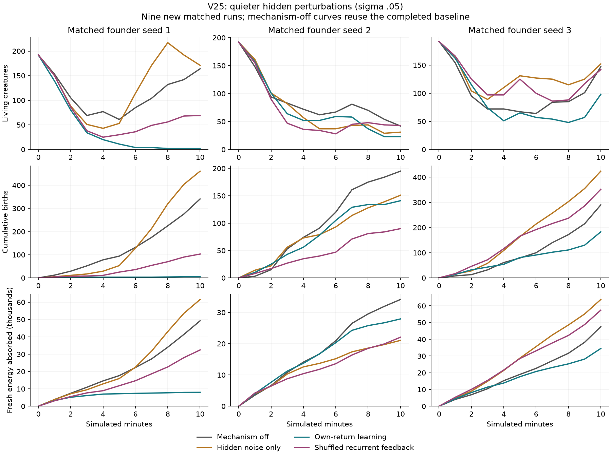
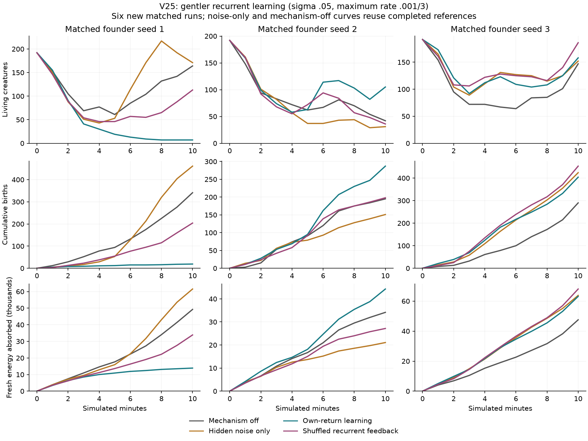

# V25 follow-up: quieter hidden perturbations

Reducing hidden noise to .05 does **not** rescue recurrent learning at the
unchanged .001 maximum learning rate. Own-return learning lowers births against
the matching noise-only control in all three starts. The prospective screen
fails, and no longer runs have been selected.

The [passive replay measurements](RECURRENT_LEARNING.md#passive-replay-diagnostic)
motivated this comparison. `configs/v25-quiet.toml` changes only
`recurrent_noise_sigma` from .15 to .05. All food, movement, inherited graphs,
motor learning/noise, local plasticity, and capacity charges remain unchanged.
Smaller sigma triples the coefficient in the recurrent likelihood score;
actual traces also depend on the resulting activity. A smaller perturbation
therefore does not imply a smaller acquired update.

## Completed screen

Nine new runs cross seeds 1/2/3 with noise-only, own-return, and shuffled-return
conditions, each for 600 seconds. All complete without extinction. The three
mechanism-off baselines are **reused** from the original V25 screen, not counted
as new runs or additional evidence. Complete founder genomes match within seed.

Values below are seeds **1 / 2 / 3**. Fresh absorption is cumulative energy in
thousands, rounded for readability.

| Condition | Final population | Births | Fresh energy absorbed (thousands) |
|---|---|---|---|
| Mechanism off, reused | 164 / 42 / 147 | 341 / 195 / 290 | 49.24 / 34.15 / 47.54 |
| Quiet noise only | 171 / 31 / 152 | 461 / 151 / 424 | 61.53 / 21.06 / 63.79 |
| Quiet own-return learning | 2 / 23 / 98 | 5 / 141 / 183 | 8.02 / 27.92 / 34.50 |
| Quiet shuffled feedback | 69 / 43 / 142 | 103 / 90 / 352 | 32.44 / 22.07 / 57.42 |

Own learning improves both births and fresh uptake in **0/3** comparisons with
noise-only, **1/3** with shuffled feedback, and **0/3** with the reused baseline.
The rule required at least two improvements against each control. Quiet noise
alone beats the baseline in two starts for both outcomes, but that is not evidence
that the recurrent learner works. No settings were changed while these runs
were underway, and the nearly collapsed first learning population is retained.



Final mean absolute acquired recurrent weights are .0088/.0150/.0151, compared
with .0038/.0095/.0095 in the original .15-noise learning pilots. The maximum
recorded saturated-row fractions are 7.29%/5.40%/6.43%, versus
1.02%/1.68%/2.20%. These are different evolving populations, not a causal
decomposition of the failure. The change in update scale is nevertheless a
reason to test rate explicitly before attributing the outcome to noise alone.

## Verification and next comparison

The [checked record](results/v25-quiet-recurrent-learning.json) contains all nine
new outcomes, labeled reused references, founder matching, source archives,
checkpoint/history agreement, masks, bounds, energy and resource accounting,
and every screening comparison. The reused baselines still match V24 physical
histories, events, and full final states exactly. This is a parameter experiment;
the tested native implementation remains the one committed in `3aa2c30`.

```bash
uv run python scripts/audit_recurrent_learning.py --quiet
uv run python scripts/plot_recurrent_learning.py --quiet
```

Raw runs are under `runs/v25-quiet-{noise-only,learning,shuffled}-pilot`.
All three calibration processes have exited. Python remains managed with uv,
and the user's V16 edits are preserved.

The subsequent prospective comparison reduces the maximum rate to `.001 / 3` while
retaining sigma .05. This restores the original rate/sigma coefficient for
otherwise identical local samples; it does not promise equal realized updates
or equal gradient variance in diverging worlds. Pair own-return and shuffled
feedback, reuse the matching quiet noise-only and mechanism-off references,
and keep the same screen against all three controls. The disabled learner's
unused rate affects its rate telemetry but has no physical effect; explicitly
verify that reuse before accepting the comparison. If the gentler variant also
fails, reassess credit assignment rather than continuing an open-ended rate grid.

## Gentler-rate follow-up

All six additional 600-second trials are complete. The lower rate improves
outcomes relative to the earlier quiet learner, but **still fails** its
predeclared screen against the controls. All populations survive to the endpoint;
the first learning population is nearly collapsed and remains in the results.

| Condition | Final population | Births | Fresh energy absorbed (thousands) |
|---|---|---|---|
| Mechanism off, reused | 164 / 42 / 147 | 341 / 195 / 290 | 49.24 / 34.15 / 47.54 |
| Quiet noise only, reused | 171 / 31 / 152 | 461 / 151 / 424 | 61.53 / 21.06 / 63.79 |
| Gentle own-return learning | 7 / 105 / 158 | 19 / 287 / 404 | 13.89 / 44.26 / 63.12 |
| Gentle shuffled feedback | 113 / 36 / 186 | 204 / 198 / 453 | 33.86 / 27.16 / 68.04 |

Own learning improves births AND fresh absorption in **1/3** comparisons with
quiet noise-only, **1/3** with gentle shuffled feedback, and **2/3** with the
mechanism-off baseline. The required two wins against each control are absent.
The stronger second start does not justify selecting it for a longer run.



Final mean absolute acquired weights are .00468/.01031/.01032; maximum recorded
saturated-row fractions are 3.32%/1.30%/1.40%. Lowering the rate changes both
acquired state and the evolving populations. These observations do not isolate
a single cause of success or failure.

Before these six trials began, the lower-rate noise-only condition was replayed
for the complete 600 seconds in all three seeds. Common measurements, events
(including whole-genome hashes), complete final physical states, and random
streams match the original quiet noise-only runs exactly. Only configuration
and the unused potential-rate measurement differ. The
[control replay record](results/v25-gentle-control-replays.json) verifies reuse;
these three verification replays are not new independent ecological replicates.

The [gentler audit](results/v25-quiet-gentle-recurrent-learning.json) includes
all six new trials, six labeled reused references, all control-replay checks,
source provenance, founder matching, bounds, masks, and resource/energy accounts.
The inspected figure is generated from that checked record.

```bash
uv run python scripts/audit_recurrent_learning.py --gentle
uv run python scripts/plot_recurrent_learning.py --gentle
```

Raw data are in `runs/v25-quiet-gentle-{learning,shuffled}-pilot` and
`runs/v25-quiet-gentle-control-replay-pilot`. All processes have exited.
V25 now has 27 new ecological trials across its three screens; reused references
and verification replays are counted separately. The native implementation is
unchanged, with its existing 447-test validation.

**This rate/noise sweep is closed.** No longer V25 runs or further points in this
grid are planned. The optional learner is retained, with the disabled mechanism
as the ecological reference. The next [credit investigation](RECURRENT_CREDIT_RESEARCH.md)
asks whether prediction feedback can improve sensory representations on matched
experience before letting a new learner alter movement.
