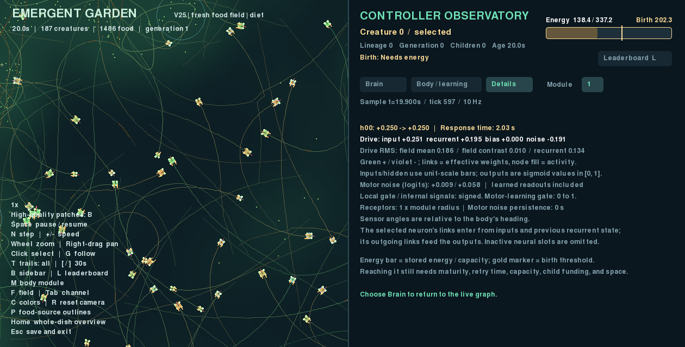
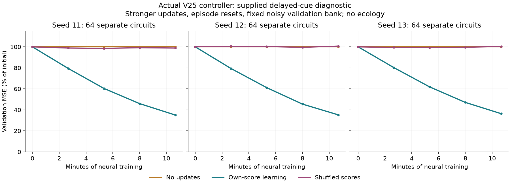
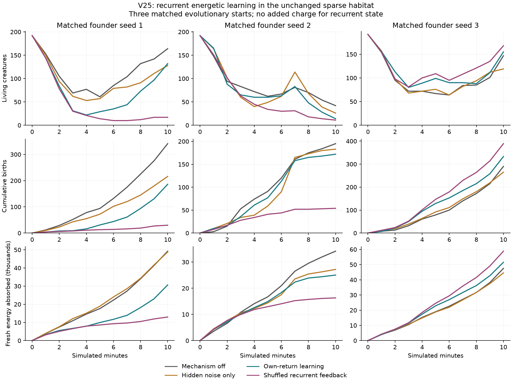

# V25: learning recurrent connections from energetic experience

V25 / package 0.26.0 adds optional within-lifetime learning inside each body's
recurrent circuit. Actual net energy can now change recurrent connections as
well as the motor readouts. The 42 inputs, seven outputs, inherited graph,
5,304-value genome, morphology, and food laws are unchanged. Offspring inherit
the genes and start with fresh acquired state.

The native implementation, CPU/CUDA replay checks, inspector checks, supplied
delayed-cue diagnostic, and all twelve ecological pilots are complete.
**The new learner fails the ecological continuation screen and remains optional.**
The prospective
[experiment plan](RECURRENT_LEARNING_PLAN.md) records the settings and continuation
rule before their results.

## Try it

```bash
uv run garden run --config configs/v25.toml --seed 1 --view --device cpu --seconds 0
```

Use `configs/v25-baseline.toml` for the same ecology with the new mechanism off.
It is intended to reproduce `v24-inherited.toml` exactly. Existing presets and
the user's working V16 configuration remain available. A resumed checkpoint
retains its own configuration.

Two new controls retain hidden perturbations and the older learning rules:

```bash
uv run garden run --config configs/v25.toml --ablation no_recurrent_learning --view --device cpu --seconds 0
uv run garden run --config configs/v25.toml --ablation shuffled_recurrent_reward --view --device cpu --seconds 0
```

The first disables the new acquired updates. The second assigns another body's
return rate to the recurrent learner without changing physical energy, sensory
feedback, or motor feedback. Singleton batches cannot be shuffled.

## Mechanism

Each expressed hidden neuron receives a small independent Gaussian perturbation
before `tanh`. The learner records which previous activities accompanied that
perturbation. Later energy intake, ordinary costs, and damage credit that old
trace. Birth and body-growth transfers are excluded from feedback. This is local
energetic reinforcement; the controller receives no desired route, food-bearing
target, or future resource state.

The acquired offsets decay, obey the inherited connection masks, and have a
per-row norm cap. The experimental preset uses noise sigma .15, maximum rate
.001, row cap .15, two-second traces, a ten-second baseline, and a 120-second
offset half-life. The existing trait 9 scales the rate through its sigmoid;
this couples the new learner to the older inherited plasticity allocation.
The bounded continuous update is an approximation to perturbation-based credit
assignment. Its mathematical diagnostic does not guarantee native improvement.

The older local plasticity rule, motor learner, inherited response times, neuron
and edge mutation, and development remain active. Their energetic capacity
charges remain in every control. **This first screen adds no separate energy
charge for the extra recurrent state.** The acquired matrices, traces, baseline,
and actual perturbation are checkpointed, but reset at birth or module growth.
Separate random streams preserve the existing founder and world draws.

The inspector includes both acquired recurrent offsets in its effective weights.
It distinguishes the older local rule's previous offsets from the new offsets
credited immediately before the displayed transition. Details shows the actual
hidden-noise contribution; the Body / learning heatmap combines both rules.
All tabs fit at heights 640, 768, 900, and 1,024 with no measured text overflow.



New telemetry reports active-connection offset magnitude, row saturation,
hidden-noise RMS, inherited potential learning rate, and cumulative absolute
offset change. The rate metric describes the encoded setting even when an
intervention disables updates. Dormant modules, neurons, and edges are excluded
where appropriate.

## Native implementation diagnostic

The earlier [mathematical and adaptation fixtures](RECURRENT_LEARNING_RESEARCH.md)
are now supplemented by a supplied delayed-cue task using the actual
`advance` and `controller_step`. Each of three seeds trains 64 separate
two-neuron circuits for 256 episodes. A cue appears for six updates, followed
by 18 without it and a separate feedback update. Validation uses an independent,
fixed noisy bank and never trains weights. All conditions share training cues
and perturbations.

| Seed | No updates: MSE | Own-score learning | Shuffled score |
|---|---:|---:|---:|
| 11 | .009090 | .003185 | .008985 |
| 12 | .009061 | .003193 | .009123 |
| 13 | .009246 | .003364 | .009277 |

These measurements use the actual native controller, with a deliberately larger
effective rate .1, row cap .5, 48-second baseline, and negligible forgetting.
Activity and eligibility reset between episodes; learned offsets and baseline
persist. Training spans 640 seconds of neural time. The roughly 64–65% error
reduction demonstrates this supplied task, without bodies, food, survival,
evolution, or a claim that ordinary creatures learn quickly enough to benefit.

Raw files are in `runs/v25-native-recurrent-probe`. The
[audited record](results/v25-native-recurrent-probe.json) includes intermediate
curves, script/source/genome hashes, final state hashes, and exact reconstruction
of validation error from every saved endpoint. No-update weights stay zero and
their validation errors remain exactly unchanged.



## Verification and ecological screen

All **447 tests** pass. Coverage includes causal credit order, the actual noisy
transition's conditional score, active masks and row bounds, fresh acquired
state at birth/growth, preserving old learned modules, intervention separation,
exact neutral V24 behavior through births/mutations, and reconstruction of the
displayed noisy update. Rendering leaves simulation trajectories and random
streams unchanged.

Separate [CPU](results/v25-cpu-recurrent.json) and
[RTX 5080](results/v25-cuda-recurrent.json) exercises pass exact device-local
checkpoint replay with births, growth, signed plasticity, and active recurrent
learning. CPU exercises five births and three growths; CUDA exercises six and
nine. They do not assert cross-device equality. Native source and the executed
verifier are archived beside both runs.

The completed ecological screen uses seeds 1/2/3 for 600 seconds in each of four
conditions: mechanism off, hidden noise only, own-return learning, and shuffled
recurrent returns. All use exactly matching inherited founders and unchanged
sparse, drifting food sources. The screen requires births **and** fresh-food
absorption to improve in at least two starts against **each** noise control
before longer runs are considered. All outcomes, including extinction, remain
in the comparison. This is a screen of evolving communities, not a fixed-genotype
demonstration of useful learning.

All twelve communities reached 600 seconds. Values below are seeds **1 / 2 / 3**;
fresh absorption is cumulative energy in thousands, rounded for readability.

| Condition | Final population | Births | Fresh energy absorbed (thousands) |
|---|---|---|---|
| Mechanism off | 164 / 42 / 147 | 341 / 195 / 290 | 49.24 / 34.15 / 47.54 |
| Hidden noise only | 128 / 26 / 119 | 216 / 183 / 265 | 48.81 / 27.19 / 44.55 |
| Own-return learning | 132 / 14 / 155 | 186 / 172 / 333 | 30.67 / 25.02 / 51.55 |
| Shuffled recurrent feedback | 17 / 11 / 168 | 30 / 54 / 389 | 12.99 / 16.30 / 58.84 |

Own-return learning beats noise alone for both births and fresh food in **1/3**
starts, and shuffled feedback in **2/3**. It therefore fails the stated screen.
Noise alone reduces births and fresh uptake against the no-noise baseline in
all three starts. This suggests the perturbations deserve scrutiny, but does
not isolate an individual learning deficit: the evolving communities diverge.
No longer V25 evolutionary runs or selected-winner continuations were launched.
Retain the inherited-timing baseline for subsequent comparisons.



The three mechanism-off runs match V24's common physical state, complete
histories, and events exactly, including genome digests and genetic variance.
All full founder genomes match within seed across treatments. Source archives,
checkpoint/history agreement, energy accounting, fertility, food provenance,
and trophic accounting pass. The
[audited results](results/v25-recurrent-learning.json) retain every outcome and
the exact screening comparisons.

The learner is active: final mean absolute recurrent offsets are
.0038/.0095/.0095, while the largest recorded fraction of rows at their bound
is only 1.02%/1.68%/2.20% across the three own-return runs. Broad row saturation
is not evident in these samples. Half of the original founders have died by
about 104/107/110 seconds, and only 15%/20%/19% reach three minutes. These
cohorts are shared ecological starts, not independent organism replicates.
The diagnostic task's stronger updates and 640-second training sequence cannot
be treated as evidence of sufficiently fast adaptation in these lives.

The next diagnostic will measure actual recurrent drive, perturbation effects,
feedback clipping, and acquired changes on untouched replay forks. It will
check whether the changed weights influence outputs and whether the energy
signal can plausibly support learning before adding architecture or larger
updates. The existing baseline and controls remain available throughout.

```bash
uv run python scripts/audit_recurrent_learning.py --probe-only
uv run python scripts/audit_recurrent_learning.py
uv run python scripts/plot_recurrent_learning.py
```

The wider objective remains adaptive behavior and a richer ecology. Recurrent
learning alone does not resolve the earlier loss of scavenger specialists.
