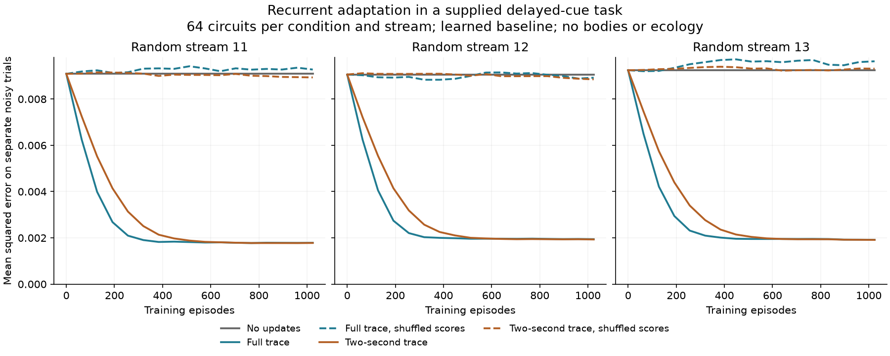

# Candidate: learning inside the recurrent circuit

Status: this research led to the optional native V25 learner. Its mathematical
and adaptation diagnostics pass, while the initial ecological screens are
mixed or negative. See [native results](RECURRENT_LEARNING.md) and the
[quieter follow-up](QUIET_RECURRENT_LEARNING.md). The material below records
the derivation and diagnostic evidence preceding that implementation.
The V24 [timing transplants](NEURAL_TIMING_ASSAYS.md) are complete and support
retaining the inherited-timing baseline for the next experiment.
This is a candidate for a later version, not evidence of ecological learning.

## Why investigate it

Motor learning currently changes two output readouts. Recurrent activity can
retain information, and the inherited plasticity rule can change recurrent
connections, but the local rule does not estimate how a particular recurrent
change affected the organism's later energetic return. Giving recurrent
connections their own exploratory eligibility could let experience change the
representation used by those readouts.

[Williams (1992)](https://doi.org/10.1007/BF00992696) develops reward-weighted
likelihood scores for stochastic units. Only the publisher's abstract was
accessible for this review. [Fiete and Seung (2006)](https://fietelab.mit.edu/wp-content/uploads/2018/12/spike_learning_theory-1.pdf)
derive neuron-perturbation eligibility and reinforcement learning for recurrent
spiking networks. Their conductance model and episodic training differ from
our leaky rate neurons and continuous ecology. These papers motivate testing
local perturbation credit; neither establishes that it will work here.

## A score appropriate to our leaky neurons

For an active recurrent connection from neuron `j` to neuron `i`, consider
independent Gaussian noise added before the nonlinearity:

```text
z_i(t) = sum_j W_ij h_j(t-1) + input_i(t) + sigma epsilon_i(t)
h_i(t) = (1 - alpha_i) h_i(t-1) + alpha_i tanh(z_i(t))
epsilon_i(t) ~ Normal(0, 1)
alpha_i = 1 - exp(-dt / tau_i)
```

Holding the realized previous and next states fixed, differentiating the
conditional transition density gives

```text
d log p(h(t) | h(t-1)) / d W_ij = epsilon_i(t) h_j(t-1) / sigma
```

There is no additional `alpha` or `tanh` derivative in this conditional
likelihood score. The change-of-variables Jacobian depends on the observed
states and fixed integration factors, but not on `W`. This argument requires
positive noise and an invertible active transition; silent nodes contribute
no score. Differentiating the trajectory by backpropagation is a different
calculation and does include the recurrent dynamics.

Summing these scores over a trajectory and multiplying by its later return
gives a candidate update. A baseline must be independent of the current sampled
perturbations to preserve that episodic expectation. Eligibility decay,
feedback clipping, bounded offsets, and continuously changing weights would
make the proposed ecological rule an approximation. They need separate tests.

## Completed mathematical check

[`scripts/probe_recurrent_score.py`](../scripts/probe_recurrent_score.py) checks
both one transition and a delayed, differentiable cue fixture. The fixture has
two neurons, response times .7 and 2 seconds, Gaussian amplitude .15, and
24 steps of .1 seconds. A signed cue appears for the first six steps, with a
supplied final target after 2.4 seconds. The weights remain fixed throughout
each trajectory. This is a mathematical circuit, not an organism.

The conditional score matches explicit autograd of the transition density to
`1e-12` tolerance. Twenty independent batches of 8,192 trajectories compare
the reward-weighted score with pathwise autograd of the complete noisy
trajectory. The paired batch differences, rather than individual tensor
entries, determine the reported standard errors.

| Quantity | Result |
|---|---:|
| Trajectories | 163,840 |
| Relative discrepancy between mean gradients | 0.541% |
| Cosine similarity of mean gradients | 0.99999719 |
| Largest absolute discrepancy / paired standard error | 0.919 |

The variance-reduction baseline is the same episode without perturbations.
It is independent of that episode's random noise, but is an oracle available
only to this diagnostic. A native organism cannot use it. This check verifies
the score calculation at the chosen weights; it does not train a network or
demonstrate a useful learning rate, temporal credit, or food seeking.

The [record](results/recurrent-score-diagnostic.json) includes all batch
estimates and the archived script hash. Exact local inputs and the archived
script are under `runs/recurrent-score-diagnostic`.

```bash
uv run python scripts/probe_recurrent_score.py --output runs/my-recurrent-score
```

## Actual weight adaptation

The diagnostic was specified before launch in
[`scripts/probe_recurrent_adaptation.py`](../scripts/probe_recurrent_adaptation.py).
It uses the same two-neuron delayed task and initial weights. Each of three
random streams, seeds 11/12/13, supplies 64 independently adapting circuits per
condition, trained for 1,024 episodes. The offset learning rate is .1 per
terminal update; each row of acquired offsets has norm at most .5. A baseline
with a 20-episode time constant uses only prior scores. No oracle is available.

Five conditions share cues and noise: no updates, full-trajectory score traces,
full traces with shuffled feedback, two-second decaying traces, and decaying
traces with shuffled feedback. Nonzero cyclic shifts assign a different
circuit's terminal score. Every 64 episodes, evaluate a separate, fixed bank
of 32 noisy trajectories per circuit. Evaluation never updates weights or the
training random stream. The main readout is mean squared target error in all
three streams; preserve saturation and individual-error records as well.
Failures would be retained: a matching gradient does not guarantee a useful
learning rule.

```bash
uv run python scripts/probe_recurrent_adaptation.py --output runs/recurrent-adaptation
```

All three batches completed. Final held-out mean squared errors are:

| Treatment | Stream 11 | Stream 12 | Stream 13 |
|---|---:|---:|---:|
| No updates | .009090 | .009061 | .009246 |
| Full trace | .001785 | .001942 | .001915 |
| Full trace, shuffled scores | .009275 | .008922 | .009632 |
| Two-second trace | .001779 | .001931 | .001912 |
| Two-second trace, shuffled scores | .008935 | .008852 | .009314 |



Both feedback-aligned rules reduce error by about 79–80% in every batch;
shuffling scores leaves it near the no-update control. At 64 episodes, the
full trace already reduces error by 30–31%, versus 19–20% for the decaying
trace. No rows are at the offset bound at the recorded endpoints. Starting
validation errors match exactly across conditions, and the no-update curves
remain exactly unchanged. The new rollout also matches the independently
checked score fixture to `1e-12` tolerance.

The [complete record](results/recurrent-adaptation.json) retains each circuit's
errors, all recorded curves, parameters, and script/final-state hashes.
This demonstrates learning in the supplied task, not ecological fitness. The
full training sequence represents about 41 minutes of neural time; 64 episodes
represent 154 seconds. Many native organisms die sooner. Episodes provide clean
resets and a single informative terminal score, whereas native feedback mixes
food, costs, bites, and competing creatures. The next implementation must test
continuous updates and energetic feedback directly.

## Native experiment still required

The result supports adding an optional, bounded recurrent update
with its own checkpointed perturbation stream. Births and new modules must start
with empty acquired state; learned offsets must never enter inherited genes.
Noise-only and shuffled-feedback controls must retain the same capacity costs.
Existing configurations must preserve exact trajectories when the feature is
disabled, and the inspector must display actual perturbations separately from
inherited bias. Test resume, growth, mutation masks, and both available devices.

Then compare native communities prospectively using the
[V25 plan](RECURRENT_LEARNING_PLAN.md). Reproduction, food absorption, and
behavioral responses matter; more internal activity alone does not establish
adaptation. The lack of scavenger specialists and lineage diversity in the V24
long runs remains a separate ecological limitation.
