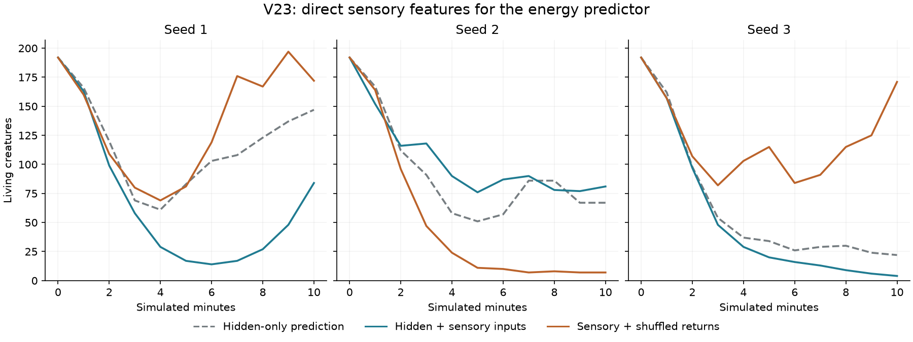
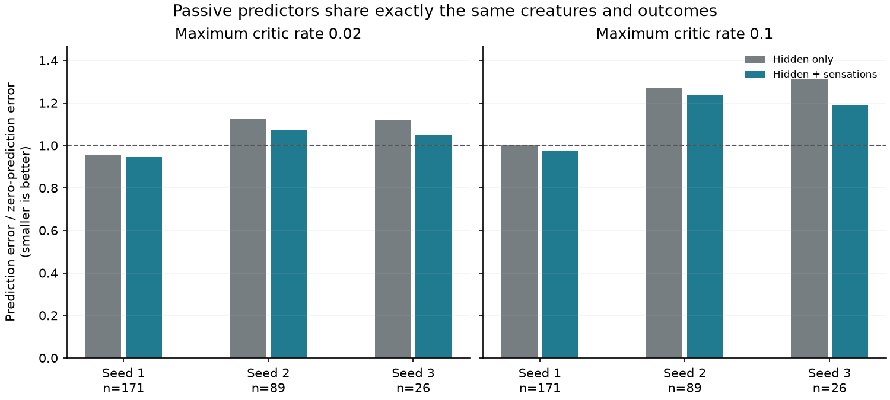

# V23: sensory access for the learned energy predictor

V23 lets each acquired value readout see the creature's existing sensory inputs
directly, alongside recurrent activity. The idea is to preserve information such
as gut fullness even when an inherited recurrent circuit represents it poorly.
The [plan](SENSORY_VALUE_PLAN.md) records the hypothesis and follow-up decision.
The user's sparse-food, inexpensive-exploration settings in `configs/v16.toml`
remain untouched.

All nine ecological pilots, three native forecast forks, and two passive
three-community comparisons are complete. Direct sensory access modestly reduces
prediction error on identical experience, but does not reliably improve births.
Increasing the predictor's learning rate makes its forecasts less accurate.
Neither change establishes useful within-lifetime motor adaptation.

## Mechanism

`motor_value_inputs = 1` uses this feature vector for the value head:

```text
normalize([current_hidden_activity, actual_controller_inputs, 1])
```

The entire vector has unit norm, including its bias. With 32 hidden slots and
42 inputs, it has 75 learned weights. Zero is the neutral default and preserves
the V22 hidden-only head's 33-weight shape and arithmetic exactly. Nonzero values
require V23 or later. Disabled value learning still restores the old running-mean
actor, regardless of the configured value feature path.

The inherited **5,272-value genome**, **42-input / seven-output recurrent
controller**, active-neuron variation, mutation, motor readout, and exploration
remain unchanged. No new sensory information or desired steering is supplied.
The predictor receives exactly the module inputs used by the controller,
including sensing interventions. All acquired value weights and history start
empty at birth and module growth; checkpoints retain them.

The preset uses V22's direct net-energy target, .02 maximum critic rate, 20-second
discount horizon, two-second trace, and weight-row norm bound of 4. Rates retain
their inherited multiplier. Whole-vector normalization changes feature scaling
as well as information access, so this is not a pure information-content test.
As in V22, no extra critic-specific energy cost is charged in this screen.
The main action graph remains the same. [Details](v23-sensory-details.png) now
states which prediction features are configured and how many weights they use.

## Ecological screening

Each treatment has three 600-second starts with exactly matched founder genomes
within each seed. `configs/v23-baseline.toml` retains hidden-only prediction;
`configs/v23.toml` enables sensory features. The third group keeps sensory features
but gives the learner another body's normalized return rate. This changes
learning feedback, not physical food, energy, or sensory experience. Singleton
batches cannot be shuffled, and correlated community signals may remain.

| Treatment | Population at 600 s, seeds 1 / 2 / 3 | Births |
|---|---|---|
| Hidden-only prediction | 147 / 67 / 22 | 348 / 230 / 71 |
| Hidden plus sensory inputs | 84 / 81 / 4 | 131 / 262 / 16 |
| Sensory inputs, shuffled returns | 172 / 7 / 171 | 480 / 25 / 384 |

Sensory access increases births in one start and reduces them in two. Own returns
also lose to shuffled returns in two starts. By the end, genomes, environments,
and population composition have diverged; these are not fixed-genotype learning
comparisons. No long ecological continuations or transplant fitness assays were
started after these mixed results.



The three neutral starts exactly reproduce V22's complete common final states
and all common physical measurements. The [audit](results/v23-sensory-values.json)
also checks source records, founder matching, resource and energy accounts,
carried-food ownership, neural state shapes, finite values, and bounds.

## Native forecasts

At 600 seconds, each sensory population was forked for 100 seconds. Every
initially mature creature contributed one core-module prediction before its
next outcomes. Deaths remain included. The primary target is observed discounted
return over that window; a learned tail estimate is reported separately.

| Sensory community | Mature forecasts | Deaths | Prediction MSE | Always-zero MSE |
|---|---:|---:|---:|---:|
| Seed 1 | 83 | 35 | 7.532 | 8.488 |
| Seed 2 | 79 | 31 | 8.490 | 8.117 |
| Seed 3 | 2 | 1 | 0.608 | 0.091 |

Only seed 1 beats zero, including in the predefined subgroup aged at least
30 seconds. Seed 3's two-creature cohort is especially uninformative about
generality. Both these forecasts and the earlier V22 hidden-only forecasts are
retained in the [forecast audit](results/v23-value-forecasts.json). Comparing
their errors directly would confound representation with different populations.

## Paired prediction on exactly the same experience

To remove that confound, each V22 direct-return community was forked at 600
seconds. Two fresh, passive critics watched every core module's actual inputs,
hidden activity, and energetic returns: one used hidden features, the other
added sensations. Both used the same inherited rate multiplier. Neither
controlled actions. Native learning, mutation, births, and deaths continued.
Newborn IDs received empty shadow state; existing creatures' shadow weights
also started empty at the fork, not at birth.

After 100 seconds of experience, predictions were recorded for the same mature
cohort. Another 100 seconds supplied exactly matching outcomes, including deaths.
The slower-rate results are:

| Community | Forecasts / deaths | Hidden-only MSE | Sensory MSE | Zero MSE |
|---|---:|---:|---:|---:|
| Seed 1 | 171 / 97 | 14.155 | 13.983 | 14.793 |
| Seed 2 | 89 / 28 | 4.824 | 4.599 | 4.289 |
| Seed 3 | 26 / 9 | 3.880 | 3.646 | 3.466 |

Sensory access reduces MSE by about 1.2%, 4.7%, and 6.0%, and has higher
prediction–return correlation in each community. It also improves MSE in all
three older subgroups. Both representations still lose to predicting zero in
two communities. These are three shared environments, not independent replicates
for every creature. The result supports a modest representation effect in these
trajectories; it does not establish improved motor credit assignment or fitness.

The follow-up repeated the same passive experiment with a fivefold maximum
critic rate, .1. Physical states at the forecast boundary and end match the
original-rate worlds exactly in every seed. Faster learning worsens MSE in all
three communities for both representations:

| Community | Faster hidden-only MSE | Faster sensory MSE |
|---|---:|---:|
| Seed 1 | 14.856 | 14.422 |
| Seed 2 | 5.451 | 5.310 |
| Seed 3 | 4.542 | 4.116 |



Correlation improves with the faster rate, while absolute prediction accuracy
declines. Some weight rows reach their norm bound. A larger or more responsive
readout is therefore not sufficient. The .02 preset is retained; no .1 ecological
treatment was promoted from this failed diagnostic. Learned tail estimates do
not change the main comparison directions. Full rows, source archives, both
observer scripts, and shadow weights remain in `runs/v23-paired*-forecasts/`.

The next diagnostic should inspect the update signals and their bounds. In
particular, clipping TD errors may affect rare large meals differently from
continuous costs. That is a hypothesis to measure, not an established cause.
More layers or stronger mutation remain possible later steps, but the present
evidence favors understanding prediction and credit assignment first.

## Verification and reproduction

All **388 tests** and Ruff checks pass. New cases verify routing of actual
sensed inputs, the absence of a direct extra actor-input path, disabled/neutral
complete-state parity, checkpoint replay, growth, fresh inheritance, and state
erasure. Passive critics reproduce the native core critic exactly under each
representation, through births and growth, while leaving the complete physical
world unchanged. Forecast timing tests cover deaths and held motor intervals.

Separate [CPU](results/v23-cpu-sensory.json) and
[RTX 5080](results/v23-cuda-sensory.json) mechanical exercises pass exact
device-local replay with births, growth, and varied inherited plasticity rules.
The first full native forecast and the first full passive fork at each rate
also match an independently unobserved continuation exactly. Other passive
forks additionally match across rates. All inspector tabs fit heights of
640–1,024 pixels; [the layout record](results/v23-viewer.json) and preview use
an illustrative 30-second seed-1 fork, not another ecological replicate.

```bash
uv run garden run --config configs/v23.toml --seed 1 --view --device cpu --seconds 0
uv run garden calibrate --config configs/v23.toml --seeds 1 2 3 --seconds 600 --device cpu --output runs/my-v23-sensory
uv run python scripts/probe_paired_values.py --sources runs/v22-raw-pilot/seed-1 runs/v22-raw-pilot/seed-2 runs/v22-raw-pilot/seed-3 --output runs/my-v23-paired
uv run python scripts/audit_sensory_values.py --paired runs/v23-paired-forecasts/summary.json --paired-fast runs/v23-paired-fast-forecasts/summary.json
uv run python scripts/plot_sensory_values.py
```

Use the baseline preset for hidden-only prediction; add
`--ablation shuffled_motor_reward` for the sensory feedback control. The passive
probe's `--rate 0.1` reproduces the faster diagnostic in a fresh output directory.
The audit refers to the original local run paths; plots read committed results.
Python and dependencies remain managed with **uv**.
