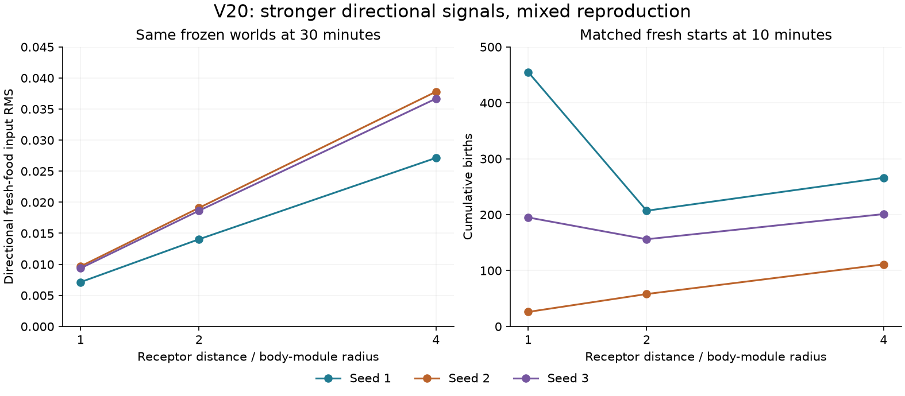

# V20: wider sensory sampling

V19's circuit diagnostics found that steady turning often outweighed the
response to small food gradients. V20 tests a physical way to strengthen that
information: sample each external field farther from the body module's center.
It does not prescribe a steering response or modify neural weights.

## Mechanism

`sensor_radius_scale` multiplies the distance of the four receptors from each
module's center. Their heading-relative angles remain −135°, −45°, +45°, +135°.
The default value 1 preserves the old trajectory exactly. Values other than 1
require V20 or later and must be positive.

All eight external fields use this footprint: fresh food, detritus, organisms,
forecast cues, secretions, the two patch identities, and shelter. Body position,
internal signals, gut fullness, food/damage feedback, and energy/contact inputs
keep their previous meaning. There remain **42 inputs, seven outputs, up to
32 recurrent neurons per module, and 5,272 inherited values**.

This experiment changes observation distance only. It adds no physical appendage,
collision shape, neural connection, energy cost, or inherited reach gene.
Movement, source production, food collection, and digestion retain V19's laws.
The inspector's [Details tab](v20-sensor-details.png) states the sampling distance.
Old presets and saved
worlds load the neutral default.

## Paired results

Three fresh starts per treatment use identical genomes, body placement, and
initial environment within each seed. They use V19's varied founder graphs,
ordinary mutation, and disabled motor exploration. The user's V16 working
configuration remains untouched.

| Preset | Radius multiplier | Population at 600 s (seeds 1 / 2 / 3) | Births |
|---|---|---|---|
| `v20-baseline.toml` | 1 | 151 / 4 / 93 | 455 / 26 / 195 |
| `v20-radius2.toml` | 2 | 152 / 11 / 102 | 207 / 58 / 156 |
| `v20.toml` | 4 | 153 / 29 / 125 | 266 / 111 / 201 |



The four-radius treatment improved births in the weakest start and slightly in
the third, but reduced them in the strongest start. It exceeded the two-radius
treatment's birth counts in these three starts. This is screening evidence, not
a generally optimal footprint. All three four-radius starts are being continued
to 1,800 seconds; those incomplete extensions are not part of the pilot table.

The frozen-world diagnostic resamples the same bodies and fields in each of the
three 1,800-second V19 populations. Increasing the radius from 1 to 4 raises the
directional fresh-food input RMS by **3.80 / 3.91 / 3.92 times**, while the mean
intensity RMS changes by less than 1.5%. Thus the intended information change is
measurable. More available directional information does not, by itself, prove
better use of it. Wider receptors also change non-food cues.

The [audit](results/v20-sensor-radius.json) verifies matching founders,
checkpoint/measurement agreement, birth and death event counts, gut constraints,
and all resource/energy ledgers. The three radius-1 runs match **every recorded
physical measurement and the complete final physical state** of the corresponding
V19 runs; only the configuration differs.

## A stronger control for within-lifetime learning

The completed [V19 learning transplants](NEURAL_VARIATION.md) found increased
births in five of six paired comparisons, but increased fresh-food intake in
only three. A new `shuffled_motor_reward` intervention tests whether correctly
assigning returns to one's own actions matters.

At each controller update it assigns each creature another creature's
body-size-normalized energetic **return rate**. A randomly chosen nonzero cyclic
shift preserves the batch's distribution and prevents self-assignment. Each
recipient integrates that rate over its own elapsed interval, including shorter
newborn intervals. Its modules receive the same reassigned signal. The shuffle
has an independent checkpointed random stream.

This changes motor-learning signals only. Physical energy, food/damage senses,
recurrent plasticity, exploration settings, and capacity costs remain intact.
A batch with only one creature cannot be shuffled. Shared environmental changes
may remain informative across creatures, so this is a control for credit
assignment rather than a guarantee that every useful signal is eliminated.
It is available for V12+ assays; it does not require changing the source habitat
to V20. The matched V19 shuffled-return follow-ups are in progress.

## Verification and use

All **322 tests pass**, with Ruff lint and formatting checks passing. Tests cover
analytical field gradients, neutral-version parity, unchanged costs/physics
under a fixed controller, replay, observer purity, shuffled-rate distributions,
newborn timing, and independence from physical energy transfer. Separate
[CPU](results/v20-cpu-radius.json) and [RTX 5080](results/v20-cuda-radius.json)
checks passed exact replay through growth, births, and evolving plasticity rules.
A further [CUDA exercise](results/v20-cuda-shuffled-reward.json) verified replay
with shuffled returns and active motor learning. The inspector was checked at
640/768/900/1024-pixel heights; all three tabs fit without scrolling.

```bash
uv run garden run --config configs/v20.toml --seed 1 --view --device cpu --seconds 0
uv run garden run --config configs/v20-baseline.toml --seed 1 --view --device cpu --seconds 0

uv run python scripts/audit_sensor_radius.py
uv run python scripts/plot_sensor_radius.py

uv run garden assay runs/v19-learning-pilot/seed-1 --seeds 601 602 \
  --seconds 360 --device cpu --modes shuffled_motor_reward \
  --output runs/my-shuffled-return-assay
```

The next neural question is whether exploration should persist long enough to
alter a creature's route. A temporally correlated policy needs a matching
learning rule; simply smoothing noise while retaining the independent-noise
eligibility formula would not be a sound comparison. The V19 delayed-credit
test already suggests that lengthening eligibility alone is insufficient in
that constructed task.
