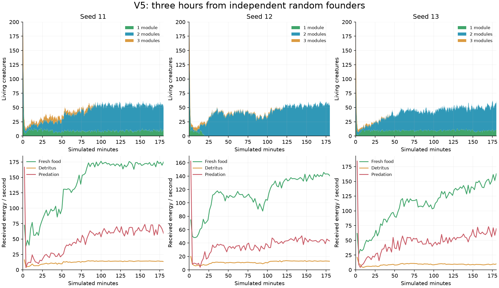
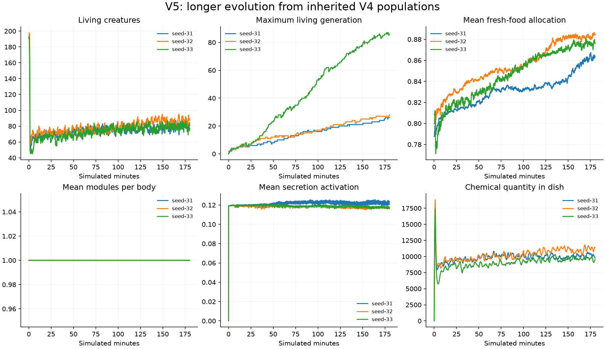

# Five-version development experiment

V0 baseline: commit `84e0c48`. Python dependencies remain managed by uv.

All five versions are implemented and evaluated. Six V5 runs completed three
simulated hours; independent random-founder runs reached living generations
39/26/41, while inherited populations reached 26/28/86. The final suite passes
64 tests. Persistence is demonstrated for those runs; increasing complexity and
communication are not. Seed 1 also produced an extinction, recorded below.

The objective is a persistent artificial ecology with inherited differences,
organism-mediated resource flows, and experimentally demonstrated uses of
information. Open-ended evolution, learning, intelligence, cooperation, and
species formation are hypotheses, not labels assigned from appearance.

## Adaptive sequence

1. V1: fixed recoverable food patches, detritus, inherited size/power/diet.
2. V2: costly contact predation and defense; inspect stability and feeding roles.
3. V3: predictive patch cues and matched sensory/memory interventions.
4. V4: a bounded developmental genome for repeated body modules and interfaces.
5. V5: environmental signals if supported by the ecology; longer integrated runs.

Each version receives mechanical tests, independent evolutionary seeds, a
recorded inspection, a written result, and a git commit. Negative results can
redirect the sequence. Existing V0 runs and defaults remain available.

## V1 design

Fresh food has a patch identifier. Each fixed patch caps its standing energy;
external supply fills vacancies at a finite rate. Unused supply is not injected.
Eating fresh food converts a fraction to detritus at the feeding location.
Digestion dissipates energy; detritus cannot recursively generate more detritus.
Unassimilated detritus energy and expired resources leave the system.

Three inherited genes, additional to neural weights, control size, propulsion
capacity, and digestion allocation. Maintenance, storage, birth investment, and
motion costs depend on the phenotype. Fresh/detritus enzymes share a budget;
specialists digest their chosen food more efficiently. Both resources have four
local chemical readings. Controllers receive energy and touch as before.

The ecological presets use a 768-unit dish, a 128-square chemical grid, 30 Hz
physics, 10 Hz brains, and 5 Hz fields to make repeated longer experiments
practical. V0's resolution and rates remain unchanged. These are abstract
overdamped circles; smaller timesteps can be checked independently.

All energy enters through founder stores and recorded fresh-food injection.
All transfers, digestive losses, maintenance, movement, birth overhead, expiry,
and living/resource stores participate in the energy ledger. Population caps
prevent births without charging parents; extinct populations are not reseeded.

## Research context

- [Taylor (2015), Requirements for Open-Ended Evolution](https://www.tim-taylor.com/papers/taylor2015requirements.web.html):
  motivates environmental feedback and viable pathways between phenotypes.
- [Sims (1994), Evolving Virtual Creatures](https://www.karlsims.com/papers/siggraph94.pdf):
  motivates developmental body/controller encodings; its task-based selection
  differs from this continuously reproducing ecology.

## Results

Experiments and decisions are appended as each version is evaluated. Raw run
directories are local and ignored by git; compact reports are committed.

### V1 — resource cycle and inherited traits

Implemented and verified with 38 tests, including V0 regressions, conservative
feeding, variable-radius contacts, birth investment, delayed detritus,
checkpoint replay, and population-assay setup. Lint and format checks pass.

The first three 600-second pilots (seeds 11–13) persisted, but detritus stores
were very small and one seed retained only one scavenger-class individual.
An explicit **3-second maturation delay** was introduced. Food discarded during
feeding becomes edible and emits its chemical cue after that delay. This leaves
more material accessible to later visitors. The original experiment is retained.

The revised preset ran for 1,200 simulated seconds per independent seed:

| Seed | Population | Births | Maximum generation | Fresh specialists | Detritus specialists | Generalists |
|---|---:|---:|---:|---:|---:|---:|
| 11 | 146 | 440 | 7 | 96 | 18 | 32 |
| 12 | 141 | 442 | 9 | 32 | 91 | 18 |
| 13 | 214 | 553 | 10 | 202 | 8 | 4 |

These categories use inherited allocation thresholds 0.65/0.35; they are **not
species**, nor proof of exclusive feeding behavior. Detritus stores were
1,267–1,911 energy units. Absolute ledger residuals were below 0.022 units.
Each run reached its full duration without reseeding or capacity saturation.
Finite-duration coexistence is observed; long-term stable coexistence is unknown.

A held-out community assay of the initial pilot's descendants across three new
environment seeds found final populations 160–165 with ordinary sensing,
168–177 with smell removed, and 131–147 without recycling. Founder communities
ended at 112–142. Thus recycling supported population persistence in these
trials, while a useful sensory advantage remains unestablished. Founder and
descendant communities have different inherited bodies and energy endowments;
this is a community comparison, not a clean individual-fitness estimate.

Artifacts: `runs/v1-pilot`, `runs/v1-maturation`, `runs/v1-assay`, and the
30-second MP4 in `runs/v1-mature-video`. The MP4 decoder and image inspection were
checked. [Compact numerical evidence](../docs/results/v1.json) includes source
hashes, seeds, final metrics, and sampled trajectories. A further assay of the
revised preset is retained under `runs/v1-mature-assay`.

Decision: retain the maturation delay and proceed to costly contact predation.
Do not claim evolved chemotaxis or memory from these trajectories.

The revised V1 assay (three held-out seeds, 180 seconds) ended with 153/172/169
descendants under normal sensing, 152/170/163 without smell, and 127/139/151
without recycling. Birth counts were higher without smell in all three pairs.
This reinforces the need to distinguish population persistence from sensory use.

### V2 design — costly predation and defense

A third chemical channel indicates local organism density. A neural output
controls a forward-facing bite within three units of the body surface. Weapon
investment reduces particle digestion and adds maintenance; armor reduces damage
but adds maintenance and movement drag. Attack attempts also cost energy.
There are no protected lineages or predefined predator/prey classes.

All attacks in a tick are settled simultaneously. Multiple attackers share a
prey's available energy; storage caps limit assimilation; remaining energy is
dissipated. Predation transfers energy rather than generating food. Reproduction
investment prevents profitable perpetual parent/offspring energy cycles.

The `no_attacks` assay suppresses transfers while retaining the same weapon and
attempt costs. It measures the ecological effect of attacks under fixed traits,
not the optimal ecology of a newly evolved peaceful population.

[Wagner et al.](https://arxiv.org/abs/1310.1369) observed digital predator/prey
coevolution exploring alternative behavioral strategies, while emphasizing that
ever-increasing trait complexity is not inevitable. This motivates the experiment
without predicting that our much smaller system will reproduce their findings.

V2 passes 42 tests. New checks cover simultaneous attacks on shared prey, storage
limits, armor costs, attack suppression, and exact V2 checkpoint replay.

| Seed | Seconds | Population | Births | Max generation | Predation deaths | Meat-eating survivors |
|---|---:|---:|---:|---:|---:|---:|
| 11 | 1200 | 66 | 208 | 6 | 67 | 21 |
| 12 | 1200 | 88 | 339 | 9 | 148 | 40 |
| 13 | 1200 | 80 | 338 | 11 | 69 | 10 |

Meat-eating survivors have acquired >20 total energy and >20% of their intake
from predation during their own lives. This is an observed feeding category,
not an inherited species label. All populations persisted; absolute energy
residuals were below 0.016 units. No parameter change was required for viability.

Matched community assays on seed-12 descendants (two new seeds, 180 seconds)
ended at populations 104/94 with attacks and 112/137 without attacks. Births
were 82/72 versus 80/98. Attacks materially alter the ecology; these observations
do not establish evolved pursuit, escape, or an escalating arms race.

Artifacts: `runs/v2-pilot`, `runs/v2-assay`, `runs/v2-video` (30-second MP4).
[Compact evidence](../docs/results/v2.json). Decision: retain predation at its tested
costs, then introduce forecast cues and direct tests of history dependence.

### V3 design — forecast cues and history probes

Patch supply now bursts for 10 seconds of each 60-second cycle, with 15% of the
mean supply rate between bursts. Burst amplitude preserves mean *offered*
supply; actual injected food still respects patch caps. Patch phases are seeded
independently. A distinct chemical cue lasts 2 seconds and ends 3 seconds before
the next burst. A sixth trait controls the recurrent integration time constant
between 0.2 and 5 seconds (with gene bounds narrowing the reachable interval).

The first pilot retained the old 180-second food lifetime. That allows food to
outlast three cycles and can leave an immediate food cue throughout the waiting
period. A second experiment shortens fresh-food lifetime to **18 seconds**, while
retaining the other settings. Both experiments are preserved. Detritus retains
its separate 240-second lifetime and maturation delay.

`garden probe RUN --output FILE.json` supplies paired left/right forecast-cue
histories to the same sampled controller and then identical observations for
1, 3, and 6 seconds. It reports motor history effects and whether their sign
points toward the past cue, with state-reset controls. This is an isolated
controller probe, not a claim of successful navigation. Community assays add
`no_cue` and `memory_reset` treatments. State resets alter ordinary dynamics as
well as stored information; performance changes alone cannot prove useful memory.

[Zou et al.](https://arxiv.org/abs/2102.12638) evolved recurrent controllers in an
explicit spatial/working-memory maze task. Their result motivates testing history
directly, but differs from our ecology and does not imply spontaneous learning.

V3 passes 47 tests, including forecast timing, mean offered resource supply,
selective cue removal, history/reset controls, and full checkpoint replay.

| Seed | Seconds | Population | Births | Max generation | Mean neural time constant |
|---|---:|---:|---:|---:|---:|
| 11 | 1800 | 40 | 158 | 11 | 1.03 s |
| 12 | 1800 | 44 | 181 | 6 | 2.38 s |
| 13 | 1800 | 29 | 149 | 8 | 1.87 s |

These are the revised 18-second fresh-food-lifetime runs. All persisted;
absolute energy residuals were below 0.033 units. The original long-food pilots
also persisted, at populations 92/71/79. The shorter lifetime produces a much
sparser ecology; it is retained as an explicit temporal-pressure experiment.

Seed-11 descendant community assays (three fresh environments, 180 seconds):

| Treatment | Final populations | Births |
|---|---|---|
| Normal | 40 / 38 / 37 | 18 / 9 / 21 |
| Forecast cue removed | 36 / 45 / 38 | 13 / 14 / 27 |
| Recurrent state reset each update | 3 / 3 / 4 | 1 / 2 / 2 |
| All chemical sensing removed | 28 / 23 / 23 | 12 / 6 / 16 |

There is a sensory benefit in this sample and a strong dependence on recurrent
dynamics. **Useful forecast memory is not established**: removing the forecast
cue has mixed effects. The isolated probe detects a mean absolute turn difference
of 0.0274 after a 3-second gap, but only 1/39 sampled descendants turns in the
cue-aligned direction. All reset controls have zero history effect. Intrinsic
dynamics can support circling or other movement patterns without adaptive recall.

Artifacts: `runs/v3-pilot`, `runs/v3-short-food`, `runs/v3-assay`, `runs/v3-video`.
[Compact trajectories](../docs/results/v3.json) and independent-run probes
([11](../docs/results/v3-probe-11.json), [12](../docs/results/v3-probe-12.json),
[13](../docs/results/v3-probe-13.json)) retain the numerical evidence. Additional
community assays of evolutionary seeds 12/13 test whether the sensory effect
generalizes; their results will be included in the next checkpoint report.

Decision: preserve the controls and negative forecast result. Proceed to bounded
developmental morphology to expand the ways creatures can sense and act.

The additional V3 assays generalized the chemical-input effect: across all
seven matched environment pairs from three independent evolutionary runs,
normal descendant communities ended with more survivors than communities with
all chemical inputs zeroed. Seed-12 pairs were 51/39 versus 36/30; seed-13 pairs
were 30/32 versus 14/17. Forecast removal still had mixed effects. State resets
left only 1–4 survivors in these additional trials. This supports a role for
chemical input and recurrent dynamics, but does not isolate spatial gradient
following from intensity responses, or useful memory from motor dynamics.

### V4 design — bounded developmental bodies

Three additional genes specify module count (1–3), spacing, and the axis of
placement. A decoder repeats a template containing four chemical sensors, two
propulsion actuators, a digestive surface, and a copy of the inherited recurrent
circuit. Circuit **parameters are shared**, but each module has its own state
and local measurements. Child neural states start empty.

Modules live within a circular exclusion membrane. This deliberately retains
simple collision physics; the visible membrane is the physical collision shape.
Feeding requires contact with a digestive module, rather than any point inside
the membrane. Off-center thrust produces torque. Tissue, membrane, extra neural
circuits, weapon capacity, and active propulsion all have costs; birth investment
scales with the developed body. More modules increase total bite capacity and
its associated costs. Copy-number mutations can fail to produce a child when
the parent cannot afford the body, without charging a failed birth.

This is a small developmental grammar with nine trait genes plus the shared
brain template. It is **not arbitrary topology, articulated mechanics, or an
unbounded genome**. It expands inherited physical organization in a testable way.

The first 18-second-food pilot produced very sparse populations. The next
experiment extends fresh-food lifetime to **45 seconds**: the last food from a
10-second burst expires before the next 60-second cycle, leaving an opportunity
for the forecast cue. Other parameters remain unchanged.

V4 passes 57 tests. Developmental tests cover bounded assembly, tissue costs,
local sensing and separate neural states, off-center torque, digestive contact,
heritable structure with fresh child states, observation purity, checkpoint
replay, and neutral extension of existing neural circuits during version transfer.

| Random-founder seed | Food lifetime | Seconds | Population | Births | Max generation | Modules 1 / 2 / 3 |
|---|---:|---:|---:|---:|---:|---|
| 11 | 18 s | 1800 | 5 | 40 | 5 | 0 / 5 / 0 |
| 12 | 18 s | 1800 | 5 | 20 | 2 | 5 / 0 / 0 |
| 13 | 18 s | 1800 | 63 | 301 | 10 | 63 / 0 / 0 |
| 11 | 45 s | 2400 | 9 | 89 | 11 | 0 / 9 / 0 |
| 12 | 45 s | 2400 | 33 | 148 | 7 | 33 / 0 / 0 |
| 13 | 45 s | 2400 | 60 | 405 | 13 | 60 / 0 / 0 |

These results show viable repeated bodies in one run, but **do not show an
advantage for greater morphological complexity**. Three-module bodies disappeared
in these experiments. Absolute energy residuals remained below 0.025 units.

An explicit `--seed-from RUN` facility transfers living genomes into a fresh
world. Existing neural weights and trait meanings are preserved. New sensory
weights start at zero, new effector biases at -2, and a new module-count gene
starts with one module near a duplication boundary. New bodies receive their
ordinary founder energy and empty neural state; this is not checkpoint resume.
Source run and source IDs are recorded. Hidden sizes must match; backward
version transfers are rejected.

V4 seeded from V3 evolutionary seed 11 reached population 59, 498 births, and
generation 16 at 2,400 seconds in its first new environment (seed 21). All living
bodies had one module. Results for two further environments appear below. These
experiments share an evolved source population and are not independent origins
of adaptation. A `pooled` assay removes the modules' distinct local readings
while preserving body geometry and costs. A `rotated` sensory control reverses
directional channels while preserving their instantaneous mean intensity.

Artifacts: `runs/v4-pilot`, `runs/v4-recovery`, `runs/v4-seeded`, `runs/v4-body-assay`,
and `runs/v4-video` (30-second recording and zoomed inspection).
[Compact evidence](../docs/results/v4.json).

Decision: retain the 45-second preset and explicit genotype transfer, keep the
cost of extra body structure, and test persistent chemical trails in V5. Greater
body complexity remains an evolutionary opportunity, not a rewarded objective.

The two further V4 environments seeded from V3 completed 2,400 seconds with
populations 69/66, births 426/398, and maximum generations 14/11. All survivors
had one module. The two-module body assay ended with 34/30 descendants under
normal local sensing, 33/30 with module observations pooled, and 8/11 with
chemical input disabled. This establishes no clear advantage from separate
module observations in these short trials.

### V5 design — persistent secretion and integrated experiments

A fourth neural output controls chemical secretion. Production and its energy
cost both scale with squared activation and developed body area. On a starvation
tick, secretion is reduced by the same fraction as the paid metabolic costs.
Chemical quantity is separate from food energy and cannot be consumed.

Secretion accumulates on the existing grid, diffuses at 12 square units/second,
and decays with a 30-second half-life. Bilinear deposition preserves injected
quantity at boundaries; flux crosses only shared faces of cells inside the dish.
Diffusion automatically substeps to maintain a stable explicit update. Decay
and diffusion run at field frequency; deposition occurs at physics frequency.
The field persists after producers move or die and supplies four new readings
to each module. These are potential traces or signals, with no assigned meaning.

`no_signal` removes reception; `no_emission` suppresses physical production while
retaining its metabolic cost. With initially empty chemical fields and mutation
disabled these controls give identical organism trajectories, which is checked.
They cannot distinguish self-trail navigation from communication between agents.

V5 archives complete states every 600 simulated seconds. Energy costs remain in
the global ledger; signaling cost is also reported as an informational subset of
maintenance. A separate chemical ledger tracks deposition, decay, and grid mass.
Pilot runs exposed a roughly 4.4-parts-per-million drift from accounting with
the analytical decay factor while the field multiplies by its float32 value.
The ledger now uses that same representable factor. This changes accounting,
not the concentration update or organism trajectories; original pilot evidence
and its residuals are retained.

Three independent random-founder V5 pilots completed 1,800 seconds:

| Seed | Population | Births | Max generation | Modules 1 / 2 / 3 |
|---|---:|---:|---:|---|
| 11 | 37 | 144 | 7 | 9 / 18 / 10 |
| 12 | 36 | 160 | 8 | 0 / 35 / 1 |
| 13 | 29 | 102 | 8 | 10 / 18 / 1 |

These runs retain more morphological variety than the tested V4 starts. Network
dimensions and founder samples also changed, so this is not evidence that
secretion caused the difference. Longer continuation tests check whether the
variety persists. Three further long runs initialize from V4's evolved populations;
these share earlier ancestry and are reported separately from random starts.

### V5 results — persistence, narrowing diversity, mixed sensory effects

Each random-founder pilot was resumed for another 9,000 seconds without changing
its physical dynamics, giving 10,800 simulated seconds in total:

| Original seed | Population | Births | Max living generation | Modules 1 / 2 / 3 | Founding lineages |
|---|---:|---:|---:|---|---:|
| 11 | 52 | 1176 | 39 | 11 / 41 / 0 | 2 |
| 12 | 52 | 1236 | 26 | 0 / 52 / 0 | 1 |
| 13 | 60 | 1476 | 41 | 11 / 49 / 0 | 2 |

All three populations recovered after a large initial decline. Two-module bodies
persisted, but three-module bodies disappeared. These body types were already
present among random founders. Five successful births changed module count in
seed 11; none did in the other two runs. This is limited structural exploration,
not evidence of an evolutionary trend toward larger bodies.

All final survivors favored fresh food by the inherited allocation threshold.
Predation still contributed to intake: 36/24/47 survivors met the measured
meat-eating criterion, and the runs recorded 468/483/604 predation deaths.
Different feeding mechanisms coexist, but specialized scavenger lineages and
broad morphological diversity were not sustained. Founding-lineage counts do
not represent species counts.



The lower panels report community intake averaged over two-minute windows.
Predation is a transfer between organisms, not another external energy source.
The curves show ecological activity; they do not isolate genetic adaptation
from changes in population size, composition, or the environment.

The other three long runs used `--seed-from` on V4 environments 21/22/23, which
all descend from V3 evolutionary seed 11. Their generation counters restart
at zero when the new world is initialized:

| V5 environment seed | V4 source environment | Population | Births | Max living generation | Modules 1 / 2 / 3 |
|---|---:|---:|---:|---:|---|
| 31 | 21 | 77 | 1574 | 26 | 77 / 0 / 0 |
| 32 | 22 | 88 | 1723 | 28 | 88 / 0 / 0 |
| 33 | 23 | 81 | 2174 | 86 | 81 / 0 / 0 |

These runs also persisted for 10,800 seconds without reseeding or reaching the
population cap. Their inherited one-module bodies remained unchanged in module
count. Their shared earlier ancestry and transfer initialization prevent treating
them as three further independent random origins, or as a paired comparison of
one-module and two-module designs.



Survival is seed-dependent. A separate V5 check with the CLI's default seed 1
became extinct at **732.17 seconds**, after six births. Seed 41 reached population
10 after 600 seconds, having fallen as low as four. These additional checks were
not selected for long continuation. The launch examples explicitly use seed 11
as a verified viewing start; this does not establish a general survival rate.

An early community assay of seed-11 descendants at 1,800 seconds used three
fresh environments for 240 seconds each. Final populations were 59/45/25 under
normal sensing, 46/33/26 without trail reception, and the identical 46/33/26
without physical emission but with its costs retained. Rotating directional
readings gave 59/33/33, and removing all chemical inputs gave 25/23/38. Trail
reception was not consistently beneficial even within that source population.

The final assay transplanted descendants from each independent 10,800-second
run into two new environments, again for 240 seconds with mutation disabled.
Cells below show **final population / births**. All trials start with 192
sampled organisms, fresh neural states, and empty trail fields.

| Evolution seed | Environment seed | Founders | Descendants | No trail sensing | Rotated readings | No chemical inputs |
|---|---|---|---|---|---|---|
| 11 | 10011 | 39 / 48 | 69 / 68 | 69 / 81 | 69 / 68 | 64 / 66 |
| 11 | 10012 | 42 / 57 | 57 / 65 | 69 / 92 | 67 / 91 | 52 / 44 |
| 12 | 10011 | 23 / 22 | 61 / 33 | 37 / 43 | 63 / 41 | 57 / 40 |
| 12 | 10012 | 15 / 15 | 63 / 40 | 38 / 45 | 61 / 45 | 57 / 49 |
| 13 | 10011 | 19 / 18 | 56 / 39 | 50 / 47 | 56 / 49 | 13 / 11 |
| 13 | 10012 | 10 / 5 | 47 / 41 | 47 / 38 | 51 / 49 | 9 / 10 |

Descendants ended with larger populations than founder transplants in all six
pairs. This includes inherited differences in body size, costs, and initial
energy investment; it is not a clean estimate of individual behavioral fitness.
Removing all chemical inputs reduced final population in all six pairs, but
births did not improve consistently with sensing. Removing trails alone gave
three positive, two tied, and one negative population effects for normal sensing;
normal sensing produced fewer births in five of those six pairs. Reversing
directional readings rarely harmed final population. Ambient chemical intensity
or altered controller dynamics could explain these effects without directional
navigation. **Useful trail following and communication remain unestablished.**

### Final validation and reproduction

- **64 tests pass**, including original V0 regressions, every version's state
  replay, conservative energy transfers, paid secretion, diffusion/decay,
  developmental bodies, transfer provenance, and treatment controls. Ruff lint,
  formatting, and the locked uv dependency resolution pass.
- A full-size late V5 checkpoint resumed with exact CPU agreement after saving
  between updates, including agents, resource arrays, fields, totals, and random
  states. An original V0 checkpoint still loads and advances.
- V5 CUDA simulation and checkpoint continuation passed on the RTX 5080 with
  PyTorch 2.11.0+cu128 at 1e-5 tolerance. This small smoke check used about 9 MB of
  allocated GPU tensor memory; it is not a full-population performance benchmark.
- The six long runs achieved roughly 11–13x simulated/wall speed on CPU while
  running concurrently. The late video run achieved 9.3x with recording enabled.
- The six long runs' final absolute energy residuals were below 0.43 units,
  against roughly 4.9–5.2 million injected food-energy units. Pilot and inherited
  runs retain the earlier chemical-accounting offset. The resumed random-origin
  runs retain that offset from their source checkpoint, with less than 0.4 units
  of additional change during 9,000 seconds. A fresh corrected-code 600-second
  run had chemical residual 0.0102 against 1.78 million emitted units.
- Historical archives retained 18 checkpoints per full long run, split as three
  pilot plus 15 continuation checkpoints for the random origins. Full states,
  events, sampled genomes, configuration, and source hashes remain under `runs/`.
- Early and late V5 MP4s were decoded and their changing frames checked. Both
  are approximately 30-second, 1024-square, 30 FPS recordings. The illustrated
  three-module creature is an early surviving founder, not a newly evolved body.
  Plots also regenerate from committed compact evidence without local raw runs.

Artifacts: [V5 compact evidence](../docs/results/v5.json),
[final verification](../docs/results/final-verification.json),
[late video](../runs/v5-late-video/timelapse.mp4), and
[early video](../runs/v5-video/timelapse.mp4). Videos and full states are local
artifacts excluded from git. The final assays are under `runs/v5-late-assay-*`.
Earlier evidence is in `docs/results/v1.json` through `v4.json`, including late
V3/V4 comparisons completed during the next version.

To repeat a random-founder long experiment and its community assay:

```bash
uv sync --locked
uv run garden run --config configs/v5.toml --seed 11 --device cpu \
  --seconds 10800 --output runs/repeat-v5-11
uv run garden assay runs/repeat-v5-11 --device cpu \
  --seeds 10011 10012 --seconds 240 --modes none no_signal rotated disabled \
  --output runs/repeat-v5-11-assay
uv run python scripts/plot_results.py
```

These commands use the final accounting code; historical raw runs retain their
recorded source hashes and numerical residuals. Reproduction across hardware or
library versions is not guaranteed to be bit-identical. The plotting command
recreates the documented experiments' figures, rather than automatically adding
a newly named run.

### What the loop established and what should come next

The result is a watchable artificial ecology: heritable neural controllers and
bodies survive, consume, reproduce, mutate, affect resource availability, prey
on one another, and leave persistent environmental traces. Multi-module bodies
can persist. None of the experiments established open-ended novelty, lifetime
learning, predictive planning, cooperative signaling, or increasing intelligence.
Adding mechanisms expanded what was possible but did not reliably preserve
ecological or morphological diversity.

The next experiment should address that observed bottleneck before adding more
outputs: spatially separated resource niches and refuges, with matched tests of
whether they preserve distinct feeding strategies across many seeds. A useful
communication experiment would also need sender/receiver interventions that
distinguish information left by another creature from self-trails or ambient
density, while retaining meaningful energy costs. Those are follow-up research
directions, not implemented V6 features.
