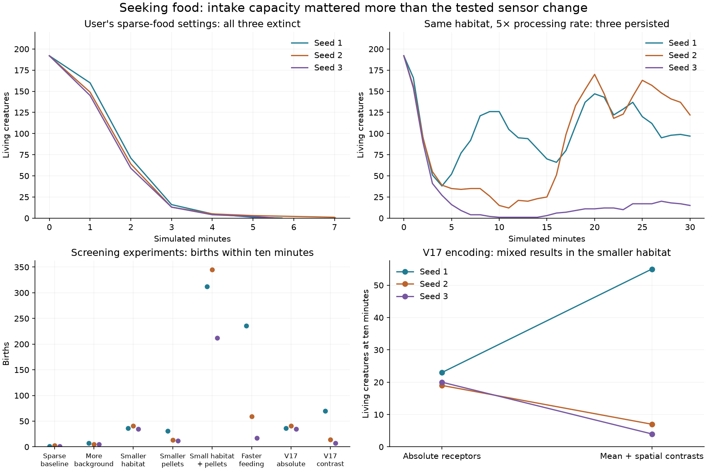

# Foraging experiments: scarce meals and affordable movement

Research resumed at the user's request on September 23, 2026. Their V16 edits
aim to reward searching between scarce, valuable meals without making movement
prohibitively expensive. The edited `configs/v16.toml` is left alone; its exact
settings at the start of these experiments are saved in
[`v16-user-baseline.toml`](../configs/v16-user-baseline.toml).

## First finding: a valuable particle is not an instantaneous meal

The baseline has a 1,024-unit dish, 100-energy particles, 20 proposed particles
per second, ten irregular drifting sources, maximum speed 40, basal cost 0.5,
and propulsion cost 0.2. These settings retain the user's exploration intent.
Actual production can be lower because of source stock and local fertility caps.

Since V11, a body must remain touching food to process it. Every 0.2 seconds,
each digestive pathway can process at most
`handling_rate / feeding_hz × tissue × diet_allocation²` raw energy. Assimilation
then depends on diet, attack investment, food quality, and recycling. Increasing
particle energy from 20 to 100 mostly lengthens the meal at an unchanged handling
rate. A creature passing quickly through food may receive only a small bite.
This provides a possible advantage to remaining nearby; it does **not** prove
that handling capacity caused the observed circling.

All three baseline starts became extinct within 5.6–7.1 simulated minutes. A
fivefold processing-rate increase, from 60 to 300, retained the large habitat,
valuable particles, and cheap movement. All three starts persisted to 30 minutes.
Seed 3 passed through a one-creature bottleneck before recovering; this is not
reliable establishment across arbitrary seeds.



| Treatment | Final populations at 600 s, seeds 1 / 2 / 3 | Births |
| --- | --- | --- |
| User baseline | 0 / 0 / 0 (early extinction) | 1 / 3 / 1 |
| Background fraction 5% → 35% | 5 / 5 / 7 | 7 / 5 / 5 |
| Dish diameter 1,024 → 512 | 23 / 19 / 20 | 36 / 41 / 35 |
| Food energy 100 → 20, five times as many proposals | 27 / 5 / 5 | 31 / 13 / 12 |
| Smaller dish and smaller particles | 86 / 110 / 97 | 312 / 345 / 212 |
| Handling rate 60 → 300 | 126 / 15 / 1 | 236 / 59 / 17 |
| V17 absolute sensing, smaller dish | 23 / 19 / 20 | 36 / 41 / 35 |
| V17 contrast sensing, smaller dish | 55 / 7 / 4 | 70 / 14 / 7 |

The three fast-feeding continuations ended at 1,800 seconds with populations
**97 / 122 / 15**, cumulative births **809 / 799 / 44**, and maximum living
generations **29 / 39 / 9**. These continue the same starts, not new replicates.
No initial neural weights were selected or tuned for these trials.

Important comparison limits:

- Reducing the dish also reduces field-grid sizes to retain physical cell widths
  (8 units for odor, 16 for fertility). It increases encounter frequency.
- More background spawning bypasses per-source stock caps more often, increasing
  realized production. This is not a fixed-energy spatial rearrangement.
- Smaller particles retain proposed and initial energy budgets by increasing
  their counts fivefold. However, the existing odor law divides source energy by
  configured particle energy, so this also increases food odor per unit energy.
- These are three-seed screening experiments. Births and persistence alone do not
  establish directed searching, useful learning, or open-ended intelligence.

The [audit](../docs/results/foraging-pilots.json) verifies all 24 pilots and three
continuations against saved checkpoints and events, checks matched founder
genomes, retains source hashes and sampled histories, and checks energy,
fertility, and trophic ledgers. Every recorded physical measurement in the V17
absolute control matches its V16 compact counterpart (apart from the version
label). The source archives and large checkpoints remain under `runs/`.

To watch the promising sparse-food treatment:

```bash
uv run garden run --config configs/v16-fast-feeding.toml --seed 1 --view --device cpu --seconds 0
# Or continue an evolved population saved locally:
uv run garden run --resume runs/v16-fast-feeding-long-1/latest.pt --view --device cpu --seconds 0
```

## V17: an optional spatial sensory basis

At 20 seconds in baseline seed 1, fresh-food input RMS was approximately 0.270
while the within-module directional contrast RMS was 0.012. None of these fresh
readings exceeded 0.9. This short diagnostic suggested that common field strength
dominated direction, rather than widespread input saturation at that moment.

V17 tests `sensory_contrast = 1`. Each field still occupies four input slots:
mean intensity, right-minus-left, front-minus-back, and a diagonal contrast.
The four raw receptors are divided by their shared local mean plus the existing
field scale before this invertible change of basis. Mean intensity is bounded
in [0, 1]; contrasts are bounded in [-1, 1]. Weak fields remain suppressed and
relative spatial differences remain available in strong fields. Shelter is
already bounded and uses only the spatial basis. This neither chooses a movement
direction nor changes inherited controller weights.

The recurrent architecture remains **40 inputs, up to 32 hidden units per module
(initially 16 active), seven outputs, and 5,144 inherited values**. Receptors are
at the same physical positions. Existing plasticity, morphology, and motor laws
remain active. New `no_direction` experiments retain intensity while removing
within-module directional contrast; `rotated` reverses the two spatial axes.
Body, feedback, stored-energy, and contact inputs are retained by these controls.

`sensory_contrast = 0` is the default and preserves old input values exactly.
`configs/v17-absolute.toml` and `configs/v17-contrast.toml` differ only in that
flag. Three paired pilots produced mixed outcomes, with one improvement and
two worse populations. **The new encoding is experimental, not a demonstrated
foraging improvement.** Genotype transfer between different encodings is rejected
because equal tensor dimensions do not imply equal input meanings. Saved legacy
worlds resume with their original encoding.

The normalization idea draws on relative sensing and divisive normalization:
[Shoval et al. (2010)](https://www.sontaglab.org/FTPDIR/shoval-et_al_pnas2010_online.pdf)
and [Carandini and Heeger (2012)](https://www.cns.nyu.edu/labs/heegerlab/content/publications/Carandini-NRN2012.pdf).
This implementation uses stateless spatial normalization; it is not the full
temporal fold-change detection mechanism in the first paper.

Verification: 281 tests pass, including legacy trajectory equality, mirrored and
rotated spatial transforms, bounded/empty inputs, checkpoint replay, observer
purity, and explicit genotype-transfer rejection. Separate
[CPU](../docs/results/v17-cpu-senses.json) and [RTX 5080](../docs/results/v17-cuda-senses.json)
exercises passed exact replay through births, growth, rule variation, and resource
changes with all accounting checks. Cross-device trajectories need not match.

Reproduce evidence and plots with:

```bash
uv run python scripts/audit_foraging.py
uv run python scripts/plot_foraging.py
```

## Follow-up sensory interventions

Two evolved fast-feeding communities were transplanted into environments 501 and
502, with 360-second trials and mutation disabled. Descendant genomes are exactly
matched across normal, disabled-field, and rotated-field treatments. The
[16-trial audit](../docs/results/foraging-sensory-assays.json) also retains the founder
comparisons and energy accounting.

| Source / environment | Births: normal | Fields removed | Fields rotated |
| --- | --- | --- | --- |
| 1 / 501 | 160 | 87 | 148 |
| 1 / 502 | 210 | 69 | 197 |
| 2 / 501 | 302 | 318 | 265 |
| 2 / 502 | 356 | 269 | 332 |

Source 1 depends on environmental signals, but its small response to rotation
offers limited evidence for directional use. Source 2's response to removing
fields is mixed. Removing fields also removes intensity and non-food signals;
these tests do not specifically prove gradient following or learned navigation.
Descendant communities outperform founder transplants in these environments, but
their body traits and initial energy investment also differ. Neither comparison
establishes within-lifetime learning.

Continue with [V18 carried food](CARRIED_FOOD.md), separating collection from
digestion while retaining finite processing, food expiry, and energy accounting.
Simple producers remain a later option from the V16 design record.
