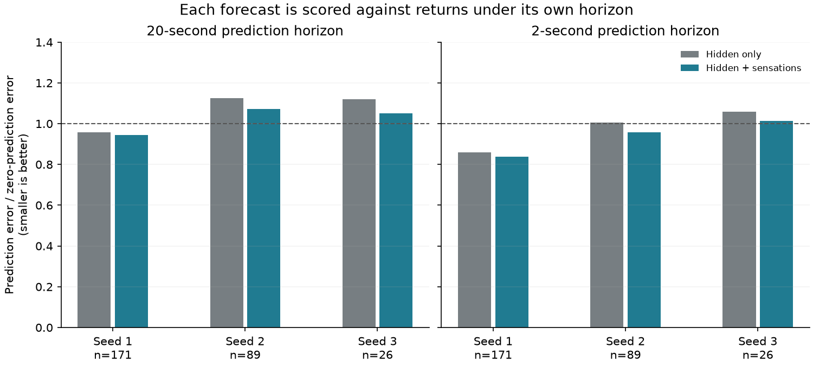
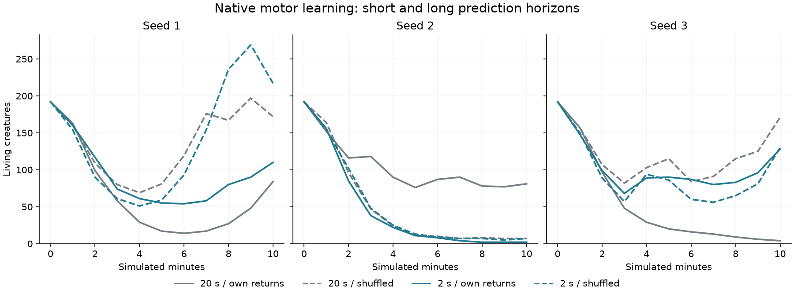

# V23 follow-up: predicting the near future

The shorter forecast target is more learnable in these diagnostic communities,
but using it for motor control does not establish a reliable learning advantage.
The [plan](PREDICTION_HORIZON_PLAN.md), three paired passive comparisons, and six
new native pilots are complete. `configs/v23-short.toml` remains an optional
preset; the main V23 configuration retains its original 20-second horizon.

## Passive prediction

The original three V22 direct-return communities were replayed with fresh
shadow critics at maximum rate .02. After the same 100-second warmup, the same
mature creatures supplied forecasts for their next 100 seconds of outcomes,
including deaths. Only the shadows' discount horizon changed, from 20 seconds
to two. Trace decay stays at two seconds, so its relationship to discount also
changes. All physical states at the forecast boundary and end match the earlier
diagnostic exactly. The native controllers and ecology remain unchanged.

Each predictor is evaluated against returns discounted by its **own** horizon.
Absolute MSE across horizons measures different targets and is not a ranking
on the same task. For the two-second target:

| Community | Forecasts / deaths | Hidden-only MSE | Sensory MSE | Zero MSE | Recent-rate MSE |
|---|---:|---:|---:|---:|---:|
| Seed 1 | 171 / 97 | .643 | .628 | .748 | .652 |
| Seed 2 | 89 / 28 | .625 | .595 | .622 | .666 |
| Seed 3 | 26 / 9 | 1.087 | 1.040 | 1.026 | 1.096 |

Sensory features improve error over hidden-only features in all three. They beat
zero in two full cohorts and in all three predefined subgroups aged at least
30 seconds, with very small margins in the latter two older subgroups. Both
representations beat recent-rate extrapolation in all three full cohorts.
These are three communities, not independent samples for every creature.
The discounted learned tail at 100 seconds is negligible for this horizon.



The [audit](../docs/results/prediction-horizons.json) checks original source hashes,
cohorts, summary calculations, and complete physical-state equality. The first
short-horizon fork also exactly matches an independently unobserved continuation.
No shadow prediction changes an action or is inherited by offspring.

## Native motor-control follow-up

The new preset changes only `motor_value_horizon` from 20 to 2. Existing V23
validation permits this because the horizon equals both two-second trace
durations. The inherited circuit, 75-feature sensory critic, mutation, rate,
exploration, food, costs, and reproduction rules are unchanged.

Six new 600-second runs cross the shorter horizon with own versus shuffled
learning returns at seeds 1/2/3. Their six long-horizon references are the
original V23 pilots, not new replicates. Founder genomes match exactly.

| Horizon / feedback | Population at 600 s, seeds 1 / 2 / 3 | Births |
|---|---|---|
| 20 s / own | 84 / 81 / 4 | 131 / 262 / 16 |
| 20 s / shuffled | 172 / 7 / 171 | 480 / 25 / 384 |
| 2 s / own | 110 / 2 / 128 | 210 / 13 / 281 |
| 2 s / shuffled | 217 / 7 / 130 | 543 / 26 / 249 |

Shorter prediction improves births in two starts, but seed 2 falls to two living
creatures. Own returns also lose to shuffled returns in two starts. This remains
a mixed evolutionary screening result. More accurate local prediction does not
by itself establish useful motor credit assignment, foraging, or fitness.



The [native audit](../docs/results/v23-short-pilots.json) verifies founder/configuration
matching, final measurements, complete birth/death events, neural bounds,
carried-food ownership, and energy/resource accounts for all twelve comparisons.
No longer continuation or fixed-genotype assay was launched from these pilots.

The retained rate and main preset remain unchanged. The next development branch
should investigate variation in the recurrent representation itself, including
neurons with different response times and more structured inherited circuits.
Those are hypotheses for subsequent work, not implemented results of this test.

## Reproduction

```bash
uv run garden run --config configs/v23-short.toml --seed 1 --view --device cpu --seconds 0
uv run python scripts/probe_paired_values.py --sources runs/v22-raw-pilot/seed-1 runs/v22-raw-pilot/seed-2 runs/v22-raw-pilot/seed-3 --output runs/my-short-forecasts --horizon 2
uv run garden calibrate --config configs/v23-short.toml --seeds 1 2 3 --seconds 600 --device cpu --output runs/my-short-pilots
uv run python scripts/audit_prediction_horizons.py --native
uv run python scripts/plot_prediction_horizons.py
```

Add `--ablation shuffled_motor_reward` for the native feedback control. The
passive horizon override never changes the world's configuration. Eight targeted
observer tests pass, including hand-calculated discount timing under the override
and native/shadow update equality; the full suite passes all **390 tests**.
The native mechanism uses the previously
verified V23 implementation; no new Python dependency or inherited gene is added.
