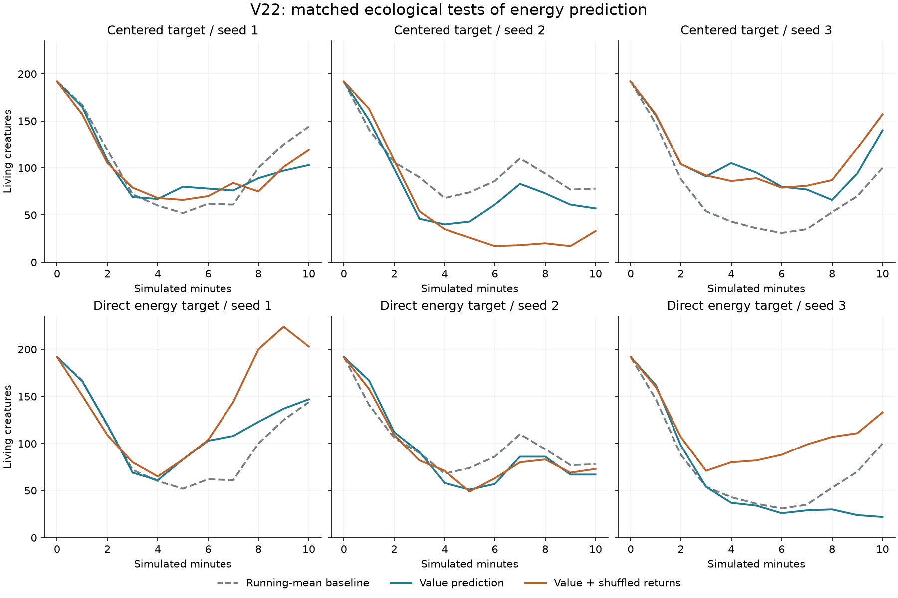
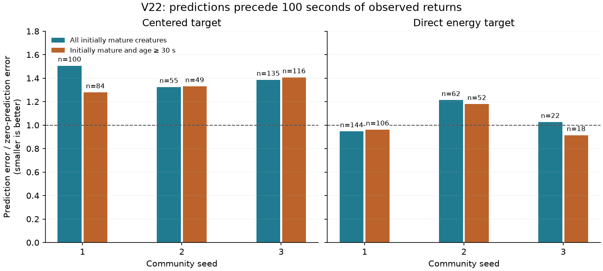

# V22: acquired predictions of energetic returns

V22 adds a small learned value readout to each body module. The hypothesis is
that predicting later energy gains can give the motor learner better feedback
about actions preceding a meal. All 15 matched pilots and six prospective
forecast diagnostics are complete. Neither prediction variant establishes a
reliable ecological improvement; forecast quality itself remains weak.

The [initial plan](VALUE_PREDICTION_PLAN.md) and failed comparisons are retained.
The user's working `configs/v16.toml` is unchanged. The test habitat retains
scarce, valuable meals, affordable movement, finite food carrying, varied
founder circuits, receptor radius 1, and independent motor exploration.

## What changes in the brain

The inherited controller remains a recurrent circuit with **42 inputs, seven
outputs, 32 available hidden slots, and 5,272 genome values**. V19's founders use
8–24 active neurons. Existing structural and weight mutation remain available.
V22 adds no sensory channel, inherited gene, actuator, or prescribed behavior.

Each module gets a disposable linear readout of its normalized hidden activity
and bias: 33 weights, an eligibility trace, and the previous feature vector.
Weights and traces start at zero. They survive checkpoint/resume but are cleared
at birth and when a new body module grows. Children inherit learning traits,
not the parent's acquired predictions.

At the next controller boundary, after observing the previous interval's return:

```text
features = normalize([hidden_activity, 1])
reward = (food_energy_absorbed - operating_costs - bite_losses) / (body_area * 10)
gamma = exp(-elapsed / 20 seconds)
delta = target_reward + gamma V(current_features) - V(previous_features)
weights += learning_rate * clip(delta, -1, 1) * previous_value_trace
trace = exp(-elapsed / 2 seconds) * previous_value_trace + current_features
```

Both value predictions use the weights **before** that update. The previous
motor eligibility trace also receives the bounded prediction error. A readiness
flag prevents inventing a transition before a module's first observation.
Reproduction transfers and growth construction costs do not enter this return.

Two targets are compared. `motor_value_centered = 1` subtracts the module's
previous running mean return rate times elapsed time. With `0`, the target is
the direct net energetic return. The latter follows the discounted-return
formulation more closely; the centered target changes as its running mean adapts.
This is a bounded approximation to ordinary online actor–critic learning,
informed by [Degris, Pilarski, and Sutton (2012)](https://people.bordeaux.inria.fr/degris/papers/DegrisACC2012.pdf).
It does not implement their natural-gradient optimizer. Partial observations,
evolving recurrent features, clipped updates, deaths, and reproduction prevent
assuming their theoretical conditions hold here.

| Setting | Value and meaning |
|---|---|
| `motor_value_rate` | .02 maximum, scaled by the existing inherited learning trait; zero disables the head |
| `motor_value_centered` | 1 for surplus above the running mean; 0 for direct net energy |
| `motor_value_horizon` | 20 seconds of exponential discounting |
| `motor_value_trace_tau` | 2 seconds of eligibility decay |
| `motor_value_limit` | Acquired weight-row norm bounded at 4 |
| Actor settings | Existing .01 maximum learning rate, .15 row-norm bound, .05–.15 exploration |

Prediction requires normalized features and V22 or later. Existing energetic
learning-capacity costs remain, but this first comparison charges **no additional
head-specific memory or computation cost**. Dead modules are discarded without
a terminal learning update. Nothing learned is passed to offspring.

The Details tab shows the actual pre-update prediction and temporal-difference
error in scaled return units. These are neither stored energy nor promises of
future food. [The preview](../docs/v22-value-details.png) and
[layout record](../docs/results/v22-viewer.json) cover all tabs at 640–1,024 pixels.

## Matched ecological pilots

Each treatment has three 600-second starts with exactly matching founder
genomes within a seed. The shared baseline retains the old running-mean motor
learner. Each prediction target also has a `shuffled_motor_reward` control:
another body's return rate drives its learning, while actual food and energy
stay with their owner. Single-body batches cannot be shuffled, and community
signals may remain correlated. Recurrent plasticity remains active throughout.

| Treatment | Population at 600 s, seeds 1 / 2 / 3 | Births |
|---|---|---|
| Running-mean baseline | 144 / 78 / 100 | 288 / 265 / 156 |
| Centered value target | 103 / 57 / 140 | 228 / 167 / 303 |
| Centered, shuffled returns | 119 / 33 / 157 | 246 / 76 / 323 |
| Direct energy target | 147 / 67 / 22 | 348 / 230 / 71 |
| Direct, shuffled returns | 203 / 73 / 133 | 481 / 193 / 300 |

Both value variants improve births over baseline in one start and reduce them
in two. Each also loses to its own shuffled-return control in two starts.
Evolving populations differ in genomes and environments by the end: these
screens do not isolate individual adaptive learning. The
[audited record](../docs/results/v22-value-prediction.json) retains configurations,
checkpoints, events, energy accounts, and source provenance.



The three disabled-head baselines match V21's complete common final state and
every common physical measurement exactly. This establishes neutral-version
compatibility separately from the ecological effects of enabling prediction.

## Does the value head predict anything useful?

Each of the six own-return populations was forked at 600 seconds. Every initially
mature creature contributed one core-module prediction at its next actual
controller update, before observing its next 100 seconds of outcomes. Returns
use the learner's body normalization and controller-interval discounts. Deaths
remain in the cohort with no later return; animals dying before their first
prediction are counted separately. Choosing mature bodies keeps size fixed.

The primary target is the observed finite-window discounted return. A separate
column adds the learned discounted tail for survivors; this tail is an estimate,
not observed future energy. Its maximum absolute contribution is below .027 in
these trials and does not change which full-cohort comparisons beat zero.
Returns are differences of cumulative float32 counters, accumulated in float64.

| Target / community seed | Mature forecasts | Deaths | Prediction MSE | Always-zero MSE |
|---|---:|---:|---:|---:|
| Centered / 1 | 100 | 50 | 3.950 | 2.621 |
| Centered / 2 | 55 | 18 | 2.809 | 2.120 |
| Centered / 3 | 135 | 71 | 4.865 | 3.509 |
| Direct / 1 | 144 | 69 | 9.126 | 9.636 |
| Direct / 2 | 62 | 21 | 6.299 | 5.193 |
| Direct / 3 | 22 | 8 | 1.567 | 1.526 |

Centered predictions are worse than zero and negatively correlated with later
centered returns in all three communities. Direct predictions beat zero in one
full cohort and beat extrapolating the initial running return rate in all three.
In the predefined subgroup aged at least 30 seconds at the start, centered
predictions still lose all three comparisons; direct predictions beat zero in
two. These animals share just three communities per treatment, not hundreds of
independent experiments. The two targets also have different variances;
their absolute errors are not a head-to-head accuracy ranking.



The [compact forecast audit](../docs/results/v22-value-forecasts.json) links original
records with per-creature observations and source/checkpoint hashes. The first
fork for each target was independently replayed without the observer and matched
its entire final state exactly. `exactly_passive: false` on the other forks means
they were not independently checked, not that a difference was found.

The measurements motivate improving prediction before expanding brain depth.
Possible limitations include a changing target, limited lifetime experience,
and useful sensory information lost in the filtered recurrent representation.
These are hypotheses, not identified causes. No long V22 ecological continuation
or fixed-genotype fitness assay was started after these weak pilot results.

## Verification and reproduction

All **363 tests** and Ruff checks pass. Tests cover hand-calculated transitions,
previous-feature credit, discount timing, bounds, fresh-state inheritance,
growth, erasure interventions, observer purity, and exact resume with both targets
and shuffled returns. A constructed four-state chain learns its known discounted
returns and shifts error earlier; that supplied representation is never seeded
into ecological controllers. Forecast fixtures cover held controller intervals,
fatal partial intervals, and deaths after the forecast window.

Separate [CPU](../docs/results/v22-cpu-value.json) and
[CUDA](../docs/results/v22-cuda-value.json) exercises pass exact device-local replay
through births, growth, and inherited plasticity rules. The
[direct-target CUDA check](../docs/results/v22-cuda-raw-value.json) also passes.
This does not claim CPU and GPU trajectories are identical.

```bash
uv run garden run --config configs/v22-raw.toml --seed 1 --view --device cpu --seconds 0
uv run garden calibrate --config configs/v22.toml --seeds 1 2 3 --seconds 600 --device cpu --output runs/my-v22-centered
uv run garden calibrate --config configs/v22.toml --seeds 1 2 3 --seconds 600 --device cpu --ablation shuffled_motor_reward --output runs/my-v22-shuffled
uv run python scripts/audit_value_prediction.py
uv run python scripts/audit_value_forecasts.py
uv run python scripts/plot_value_prediction.py
```

Use `configs/v22-baseline.toml` for the disabled-head reference and
`configs/v22-raw.toml` for direct returns. `no_motor_value` disables only the
critic, restoring the running-mean actor. `no_motor_learning` also removes motor
readout updates; `no_plasticity` additionally disables recurrent plasticity.
Audit commands refer to the original local `runs/v22-*` paths. Plots regenerate
from committed compact result records; simulations and full checkpoints remain
local under `runs/`.
